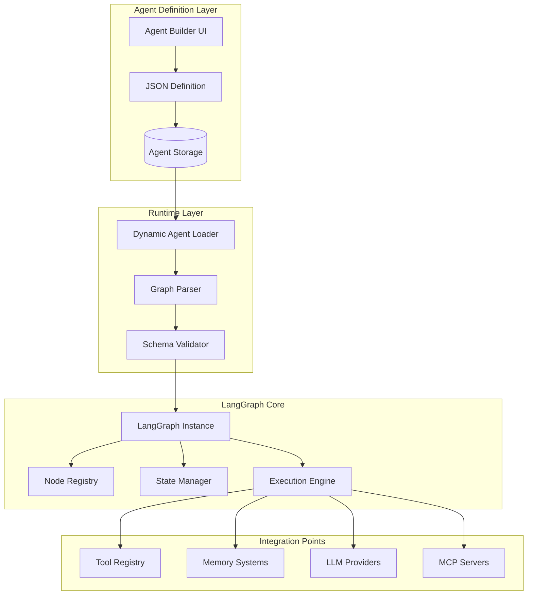
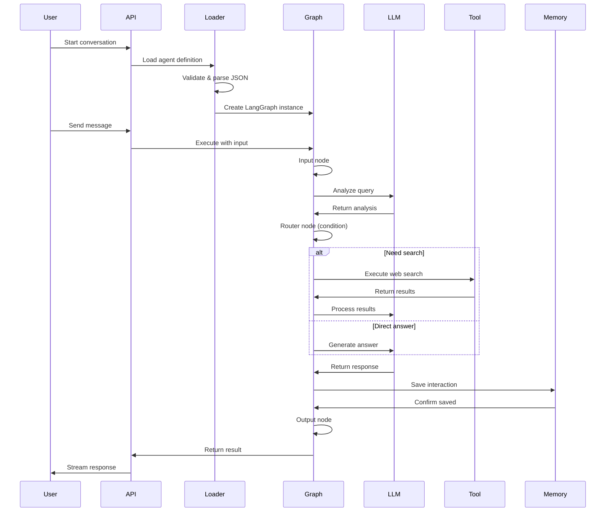

# LangGraph Integration Architecture
## Dynamic Agent System with Runtime Loading

## Overview

Die LangGraph Integration ermöglicht es, KI-Agenten dynamisch zur Laufzeit zu laden und auszuführen. Agenten werden als JSON definiert und können über die UI erstellt und verwaltet werden, ohne Code-Änderungen am Backend.

## Konzeptionelle Architektur



## Agent Definition Schema

### Basis-Schema

```json
{
  "$schema": "http://json-schema.org/draft-07/schema#",
  "type": "object",
  "required": ["id", "name", "graph", "config"],
  "properties": {
    "id": {
      "type": "string",
      "format": "uuid"
    },
    "name": {
      "type": "string",
      "minLength": 3,
      "maxLength": 255
    },
    "description": {
      "type": "string"
    },
    "type": {
      "type": "string",
      "enum": ["general", "specialist", "coordinator", "team"]
    },
    "graph": {
      "$ref": "#/definitions/GraphDefinition"
    },
    "config": {
      "$ref": "#/definitions/AgentConfig"
    },
    "tools": {
      "type": "array",
      "items": {
        "type": "string",
        "format": "uuid"
      }
    },
    "capabilities": {
      "type": "array",
      "items": {
        "type": "string",
        "enum": ["web_search", "code_execution", "file_access", "memory_access"]
      }
    }
  }
}
```

### Graph Definition

```json
{
  "definitions": {
    "GraphDefinition": {
      "type": "object",
      "required": ["nodes", "edges", "entry_point"],
      "properties": {
        "nodes": {
          "type": "array",
          "items": {
            "$ref": "#/definitions/NodeDefinition"
          }
        },
        "edges": {
          "type": "array",
          "items": {
            "$ref": "#/definitions/EdgeDefinition"
          }
        },
        "entry_point": {
          "type": "string",
          "description": "ID of the starting node"
        }
      }
    },
    "NodeDefinition": {
      "type": "object",
      "required": ["id", "type"],
      "properties": {
        "id": {
          "type": "string"
        },
        "type": {
          "type": "string",
          "enum": ["input", "llm", "tool", "condition", "memory", "output"]
        },
        "config": {
          "type": "object",
          "description": "Node-specific configuration"
        }
      }
    },
    "EdgeDefinition": {
      "type": "object",
      "required": ["from", "to"],
      "properties": {
        "from": {
          "type": "string"
        },
        "to": {
          "type": "string"
        },
        "condition": {
          "type": "object",
          "description": "Optional condition for edge traversal"
        }
      }
    }
  }
}
```

## Beispiel: Research Assistant Agent

```json
{
  "id": "550e8400-e29b-41d4-a716-446655440000",
  "name": "Research Assistant",
  "type": "specialist",
  "description": "An agent specialized in research and information gathering",
  "graph": {
    "nodes": [
      {
        "id": "input",
        "type": "input",
        "config": {
          "schema": {
            "query": {"type": "string", "required": true}
          }
        }
      },
      {
        "id": "analyze_query",
        "type": "llm",
        "config": {
          "prompt_template": "Analyze this research query and determine the best approach:\n{query}\n\nOutput a JSON with:\n- search_needed: boolean\n- search_queries: array of search queries\n- direct_answer_possible: boolean",
          "model": "gpt-4",
          "output_parser": "json"
        }
      },
      {
        "id": "router",
        "type": "condition",
        "config": {
          "conditions": [
            {
              "if": "search_needed == true",
              "then": "web_search"
            },
            {
              "if": "direct_answer_possible == true",
              "then": "generate_answer"
            }
          ],
          "default": "clarify_query"
        }
      },
      {
        "id": "web_search",
        "type": "tool",
        "config": {
          "tool_id": "web_search_tool",
          "input_mapping": {
            "queries": "{{search_queries}}"
          }
        }
      },
      {
        "id": "process_results",
        "type": "llm",
        "config": {
          "prompt_template": "Based on these search results:\n{search_results}\n\nAnswer the original query:\n{query}",
          "model": "gpt-4"
        }
      },
      {
        "id": "generate_answer",
        "type": "llm",
        "config": {
          "prompt_template": "Answer this query based on your knowledge:\n{query}",
          "model": "gpt-4"
        }
      },
      {
        "id": "clarify_query",
        "type": "llm",
        "config": {
          "prompt_template": "The query '{query}' needs clarification. Ask for more details.",
          "model": "gpt-3.5-turbo"
        }
      },
      {
        "id": "save_to_memory",
        "type": "memory",
        "config": {
          "operation": "save",
          "memory_type": "long_term",
          "data_mapping": {
            "query": "{{query}}",
            "answer": "{{result}}",
            "timestamp": "{{current_timestamp}}"
          }
        }
      },
      {
        "id": "output",
        "type": "output",
        "config": {
          "format": "markdown"
        }
      }
    ],
    "edges": [
      {"from": "input", "to": "analyze_query"},
      {"from": "analyze_query", "to": "router"},
      {"from": "router", "to": "web_search"},
      {"from": "router", "to": "generate_answer"},
      {"from": "router", "to": "clarify_query"},
      {"from": "web_search", "to": "process_results"},
      {"from": "process_results", "to": "save_to_memory"},
      {"from": "generate_answer", "to": "save_to_memory"},
      {"from": "clarify_query", "to": "output"},
      {"from": "save_to_memory", "to": "output"}
    ],
    "entry_point": "input"
  },
  "config": {
    "llm_provider": "openai",
    "default_model": "gpt-4",
    "temperature": 0.7,
    "max_tokens": 4000,
    "timeout_seconds": 30,
    "retry_policy": {
      "max_retries": 3,
      "backoff_factor": 2
    }
  },
  "tools": [
    "550e8400-e29b-41d4-a716-446655440001"
  ],
  "capabilities": [
    "web_search",
    "memory_access"
  ]
}
```

## Dynamic Agent Loader Implementation

### Konzept

```python
from typing import Dict, Any, Optional
from langgraph.graph import Graph, Node
from langgraph.graph.state import GraphState
import json

class DynamicAgentLoader:
    """
    Lädt Agent-Definitionen aus JSON und erstellt LangGraph Instanzen
    """
    
    def __init__(self, 
                 tool_registry: ToolRegistry,
                 memory_manager: MemoryManager,
                 llm_router: LLMRouter):
        self.tool_registry = tool_registry
        self.memory_manager = memory_manager
        self.llm_router = llm_router
        self.node_factories = self._initialize_node_factories()
    
    def load_agent(self, agent_definition: Dict[str, Any]) -> Graph:
        """
        Hauptmethode zum Laden eines Agenten aus JSON
        """
        # Validate schema
        self._validate_schema(agent_definition)
        
        # Create graph
        graph = Graph()
        
        # Create state schema
        state_schema = self._create_state_schema(agent_definition)
        graph.set_state_schema(state_schema)
        
        # Add nodes
        for node_def in agent_definition['graph']['nodes']:
            node = self._create_node(node_def, agent_definition['config'])
            graph.add_node(node_def['id'], node)
        
        # Add edges
        for edge_def in agent_definition['graph']['edges']:
            if 'condition' in edge_def:
                condition = self._create_condition(edge_def['condition'])
                graph.add_conditional_edge(
                    edge_def['from'],
                    condition,
                    {edge_def['to']: edge_def['to']}
                )
            else:
                graph.add_edge(edge_def['from'], edge_def['to'])
        
        # Set entry point
        graph.set_entry_point(agent_definition['graph']['entry_point'])
        
        return graph.compile()
    
    def _create_node(self, node_def: Dict, config: Dict) -> Node:
        """
        Factory method für Node-Erstellung basierend auf Typ
        """
        node_type = node_def['type']
        node_config = node_def.get('config', {})
        
        if node_type not in self.node_factories:
            raise ValueError(f"Unknown node type: {node_type}")
        
        return self.node_factories[node_type](node_config, config)
    
    def _initialize_node_factories(self) -> Dict[str, callable]:
        """
        Registriert Node-Factory-Funktionen für jeden Node-Typ
        """
        return {
            'input': self._create_input_node,
            'llm': self._create_llm_node,
            'tool': self._create_tool_node,
            'condition': self._create_condition_node,
            'memory': self._create_memory_node,
            'output': self._create_output_node
        }
```

### Node Factory Beispiele

```python
def _create_llm_node(self, node_config: Dict, agent_config: Dict) -> Node:
    """
    Erstellt einen LLM Node
    """
    async def llm_node(state: GraphState) -> GraphState:
        # Get LLM provider
        provider_id = agent_config.get('llm_provider', 'default')
        model = node_config.get('model', agent_config.get('default_model'))
        
        # Build prompt
        prompt_template = node_config['prompt_template']
        prompt = self._render_template(prompt_template, state)
        
        # Call LLM
        response = await self.llm_router.complete(
            provider_id=provider_id,
            model=model,
            prompt=prompt,
            temperature=node_config.get('temperature', agent_config.get('temperature', 0.7)),
            max_tokens=node_config.get('max_tokens', agent_config.get('max_tokens', 2000))
        )
        
        # Parse output if needed
        if node_config.get('output_parser') == 'json':
            try:
                result = json.loads(response.content)
                state.update(result)
            except json.JSONDecodeError:
                state['error'] = 'Failed to parse JSON response'
        else:
            state['result'] = response.content
        
        return state
    
    return llm_node

def _create_tool_node(self, node_config: Dict, agent_config: Dict) -> Node:
    """
    Erstellt einen Tool Node
    """
    async def tool_node(state: GraphState) -> GraphState:
        tool_id = node_config['tool_id']
        tool = self.tool_registry.get_tool(tool_id)
        
        # Map inputs
        inputs = {}
        for key, mapping in node_config.get('input_mapping', {}).items():
            inputs[key] = self._resolve_value(mapping, state)
        
        # Execute tool
        try:
            result = await tool.execute(inputs)
            state['tool_result'] = result
            
            # Map outputs if specified
            if 'output_mapping' in node_config:
                for key, path in node_config['output_mapping'].items():
                    state[key] = self._extract_value(result, path)
        except Exception as e:
            state['error'] = f"Tool execution failed: {str(e)}"
        
        return state
    
    return tool_node
```

## Runtime Execution Flow



## Security Considerations

### 1. Schema Validation
```python
def _validate_schema(self, definition: Dict) -> None:
    """
    Validates agent definition against JSON schema
    """
    try:
        jsonschema.validate(definition, AGENT_SCHEMA)
    except jsonschema.ValidationError as e:
        raise ValueError(f"Invalid agent definition: {e.message}")
```

### 2. Sandbox Execution
```python
class SandboxedToolExecutor:
    """
    Führt Tools in isolierter Umgebung aus
    """
    async def execute(self, tool_id: str, inputs: Dict) -> Any:
        async with self.create_sandbox() as sandbox:
            # Copy tool code to sandbox
            # Execute with resource limits
            # Return sanitized output
            pass
```

### 3. Access Control
```python
def check_agent_access(user: User, agent: Agent) -> bool:
    """
    Prüft ob User Zugriff auf Agent hat
    """
    # Check tenant
    if user.tenant_id != agent.tenant_id:
        return False
    
    # Check roles
    if not any(role in user.roles for role in agent.allowed_roles):
        return False
    
    # Check team access for team agents
    if agent.type == 'team' and agent.team_id not in user.team_ids:
        return False
    
    return True
```

## Performance Optimizations

### 1. Agent Caching
```python
class AgentCache:
    """
    Cacht kompilierte Agents im Memory
    """
    def __init__(self, max_size: int = 100):
        self.cache = LRUCache(max_size)
    
    def get_or_load(self, agent_id: str) -> Graph:
        if agent_id in self.cache:
            return self.cache[agent_id]
        
        definition = load_from_db(agent_id)
        graph = loader.load_agent(definition)
        self.cache[agent_id] = graph
        return graph
```

### 2. Parallel Node Execution
```python
async def execute_parallel_nodes(nodes: List[Node], state: GraphState) -> GraphState:
    """
    Führt unabhängige Nodes parallel aus
    """
    tasks = [node(state.copy()) for node in nodes]
    results = await asyncio.gather(*tasks)
    
    # Merge results
    merged_state = state.copy()
    for result in results:
        merged_state.update(result)
    
    return merged_state
```

## Monitoring & Debugging

### 1. Execution Tracing
```python
class ExecutionTracer:
    """
    Traced Agent-Ausführungen für Debugging
    """
    def trace_node(self, node_id: str, state_before: Dict, state_after: Dict):
        trace_event = {
            'node_id': node_id,
            'timestamp': datetime.utcnow(),
            'state_diff': self.compute_diff(state_before, state_after),
            'duration_ms': self.measure_duration()
        }
        self.store_trace(trace_event)
```

### 2. Agent Metrics
```python
class AgentMetrics:
    """
    Sammelt Metriken über Agent-Performance
    """
    async def record_execution(self, agent_id: str, execution_data: Dict):
        await self.increment_counter(f"agent.{agent_id}.executions")
        await self.record_histogram(f"agent.{agent_id}.duration", execution_data['duration'])
        await self.record_gauge(f"agent.{agent_id}.tokens", execution_data['tokens_used'])
```

## Future Enhancements

### 1. Visual Agent Builder
- Drag-and-drop Node Editor
- Live Preview
- Template Library
- Version Control

### 2. Agent Marketplace
- Public Agent Repository
- Rating System
- Usage Analytics
- Revenue Sharing

### 3. Advanced Features
- Multi-Agent Orchestration
- Agent Learning/Adaptation
- Cross-Tenant Agent Sharing
- Agent Performance Optimization

---

**Document Version**: 1.0  
**Last Updated**: 2025-01-23  
**Related**: LangGraph Documentation, Agent System Design