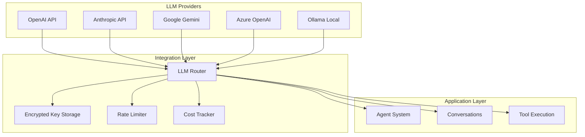
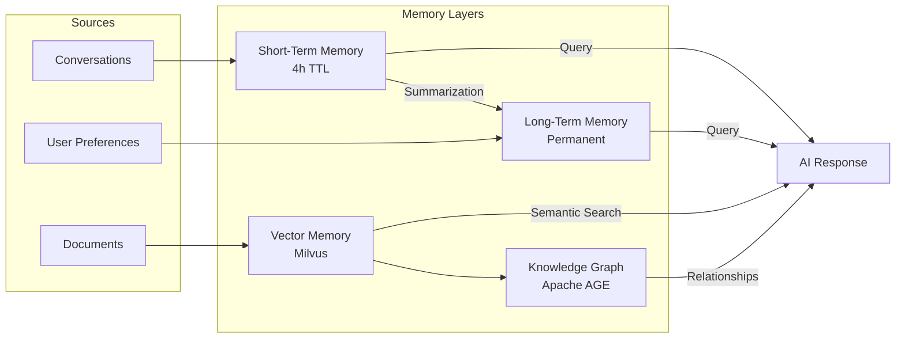
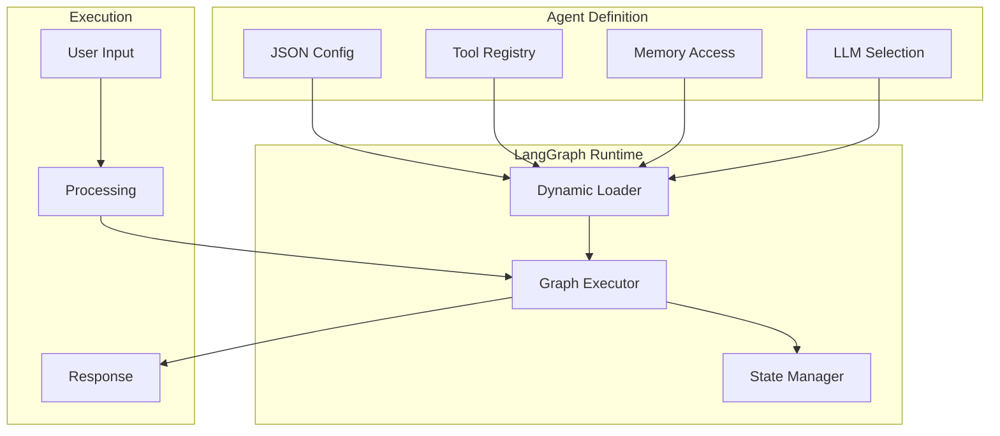
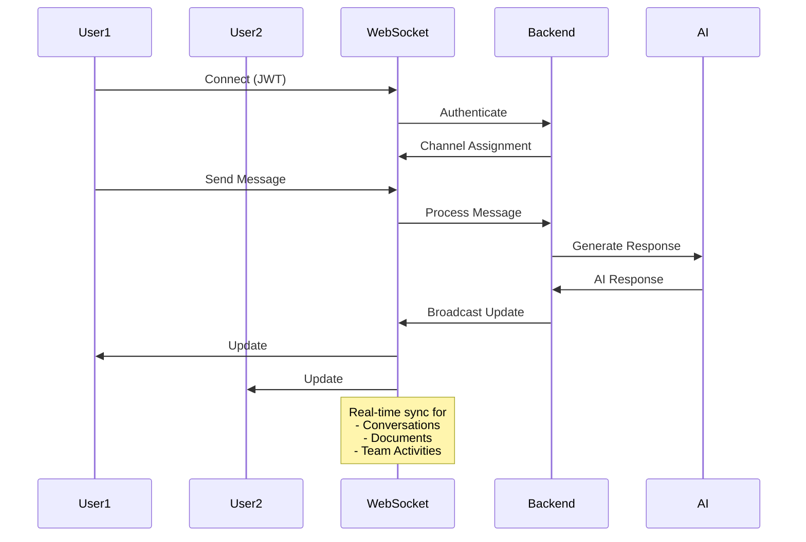
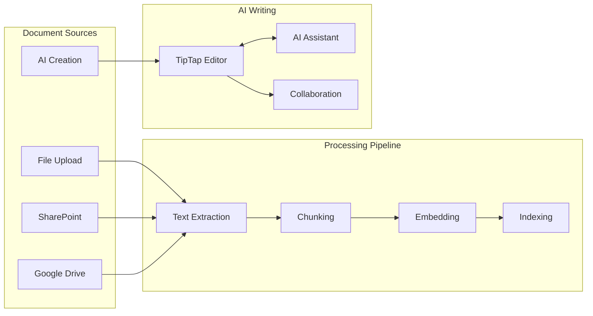
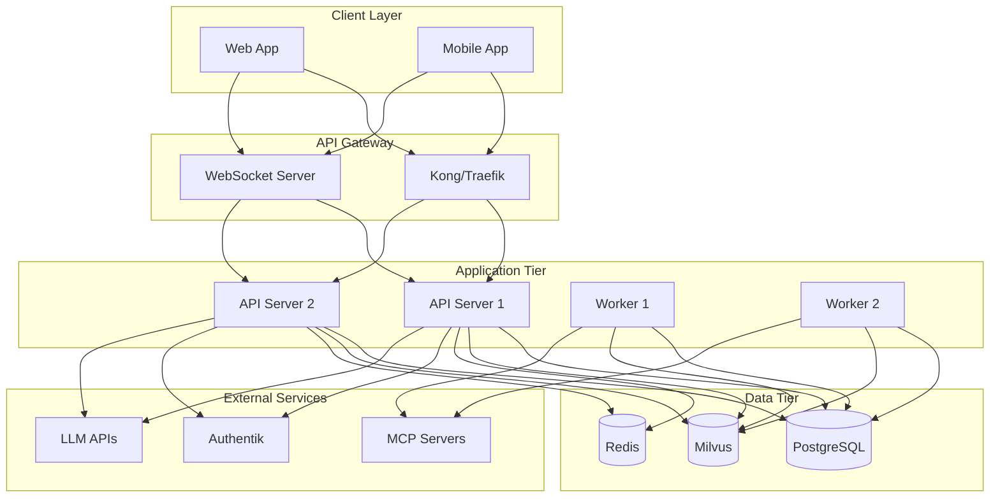

# nAI Platform Architecture
## Enterprise AI Platform with Multi-LLM Support

## Overview

Die nAI Platform ist eine Enterprise-grade AI-Lösung, die es Unternehmen ermöglicht, ihre eigene AI-Infrastruktur aufzubauen und zu verwalten. Die Plattform unterstützt multiple LLM-Provider, bietet ein ausgeklügeltes Memory-System und ermöglicht Team-Kollaboration in Echtzeit.

## Kernkomponenten

### 1. Multi-LLM Integration Layer

#### Key Features:
- **Sichere API-Key Verwaltung**: AES-256 Verschlüsselung
- **Provider-agnostisch**: Einheitliche Schnittstelle für alle LLMs
- **Cost Tracking**: Detaillierte Kostenerfassung pro Tenant/User/Team
- **Rate Limiting**: Schutz vor Überlastung und Kostenkontrolle

### 2. Memory Architecture

#### Memory Types:

1. **Short-Term Memory (STM)**
   - Lebensdauer: 4 Stunden nach letzter Aktivität
   - Zweck: Aktiver Konversationskontext
   - Automatische Bereinigung

2. **Long-Term Memory (LTM)**
   - Persistente Speicherung wichtiger Fakten
   - User Preferences (global)
   - Gelernte Muster und Präferenzen

3. **Vector Memory (Milvus)**
   - Semantic Search über Dokumente
   - Embedding-basierte Ähnlichkeitssuche
   - Skalierbar für Millionen von Dokumenten

4. **Knowledge Graph (Apache AGE)**
   - Beziehungen zwischen Entitäten
   - "Welche anderen Dokumente hat dieser Autor geschrieben?"
   - Dokumenten-Level Rechteverwaltung

### 3. Agent System (LangGraph)

#### Agent Features:
- **Dynamisches Laden**: Agents werden zur Laufzeit geladen
- **JSON-basierte Definition**: UI-Editor für Agent-Konfiguration
- **Tool Integration**: Zugriff auf definierte Tools und MCP Server
- **Team Agents**: Ein Agent pro Team mit spezifischem Verhalten

### 4. Real-time Collaboration

#### WebSocket Features:
- **JWT Authentication**: Sichere Verbindungen
- **Channel-basiert**: Teams, Conversations, Documents
- **Real-time Updates**: Sofortige Synchronisation
- **Presence Tracking**: Wer arbeitet gerade woran

### 5. Document Processing & AI Writing

#### Document Features:
- **Multi-Source Integration**: SharePoint, Google Drive, etc.
- **Rechteverwaltung**: Dokumenten-Level Permissions
- **AI Writing Assistant**: Kollaboratives Schreiben mit AI
- **TipTap Integration**: Rich-Text Editor mit AI-Features

## Technologie-Stack

### Backend
- **Framework**: FastAPI (Python)
- **Async**: Full async/await support
- **WebSockets**: Real-time communication
- **LangGraph**: Agent orchestration

### Datenbanken
- **Primary**: PostgreSQL 14+
- **Graph**: Apache AGE (PostgreSQL Extension)
- **Vector**: Milvus
- **Cache**: Redis

### Security
- **Authentication**: Authentik (passwordless)
- **Encryption**: AES-256 für API Keys
- **RLS**: Row-Level Security in PostgreSQL
- **Sandbox**: Sichere Tool-Execution

### Integration
- **MCP**: Model Context Protocol für externe Tools
- **OAuth**: Für externe Service-Integration
- **Webhooks**: Event-driven Architecture

## Deployment Architecture

## Skalierung

### Horizontal Scaling
- **API Server**: Stateless, beliebig skalierbar
- **Worker**: Queue-basiert, auto-scaling
- **WebSocket**: Sticky Sessions mit Redis Pub/Sub

### Datenbank Scaling
- **PostgreSQL**: Read Replicas für Queries
- **Milvus**: Distributed Mode für große Deployments
- **Redis**: Cluster Mode für High Availability

## Performance Optimierungen

### Token-Optimierung
1. **Conversation Checkpoints**: Alle 50 Nachrichten
2. **Summarization**: Automatische Zusammenfassung
3. **Selective Context**: Nur relevante Memory-Teile laden

### Caching Strategy
1. **Redis**: Session Data, STM
2. **PostgreSQL**: Materialized Views für Analytics
3. **Milvus**: Pre-computed Embeddings

### Async Processing
1. **Document Processing**: Background Jobs
2. **Knowledge Graph Updates**: Async Integration
3. **Usage Tracking**: Batch Updates

## Monitoring & Observability

### Metrics
- **Application**: Prometheus metrics
- **Database**: pg_stat_statements
- **LLM Usage**: Custom tracking per provider

### Logging
- **Structured Logging**: JSON format
- **Trace IDs**: Request tracing
- **Audit Trail**: Compliance logging

### Alerting
- **Cost Alerts**: Bei Überschreitung von Limits
- **Performance**: Slow queries, high latency
- **Security**: Failed auth attempts

## Disaster Recovery

### Backup Strategy
1. **PostgreSQL**: Daily backups, PITR
2. **Milvus**: Snapshot backups
3. **Document Storage**: Object Storage mit Versioning

### High Availability
1. **Multi-AZ Deployment**: Verfügbarkeit
2. **Auto-Failover**: Für kritische Komponenten
3. **Data Replication**: Cross-region für Enterprise

---

**Document Version**: 1.0  
**Last Updated**: 2025-01-23  
**Status**: Architecture Blueprint