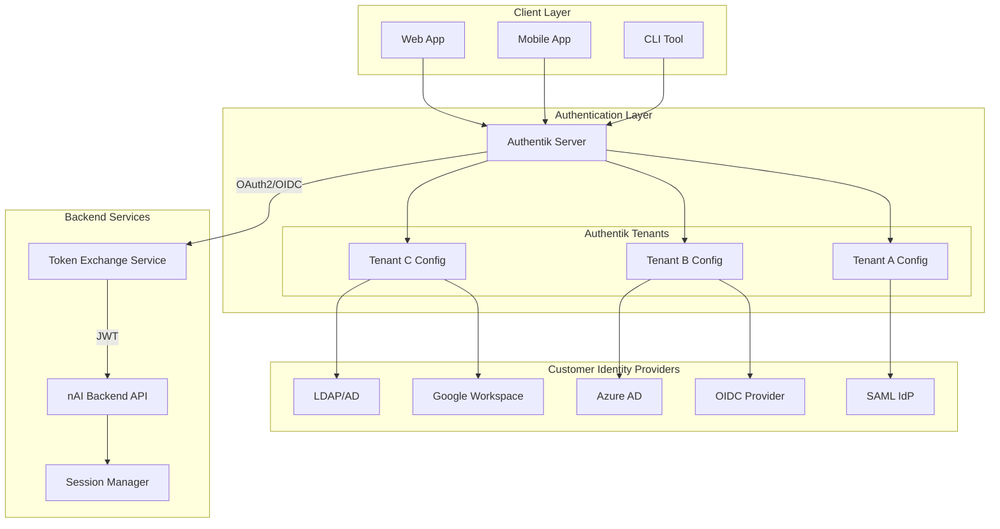
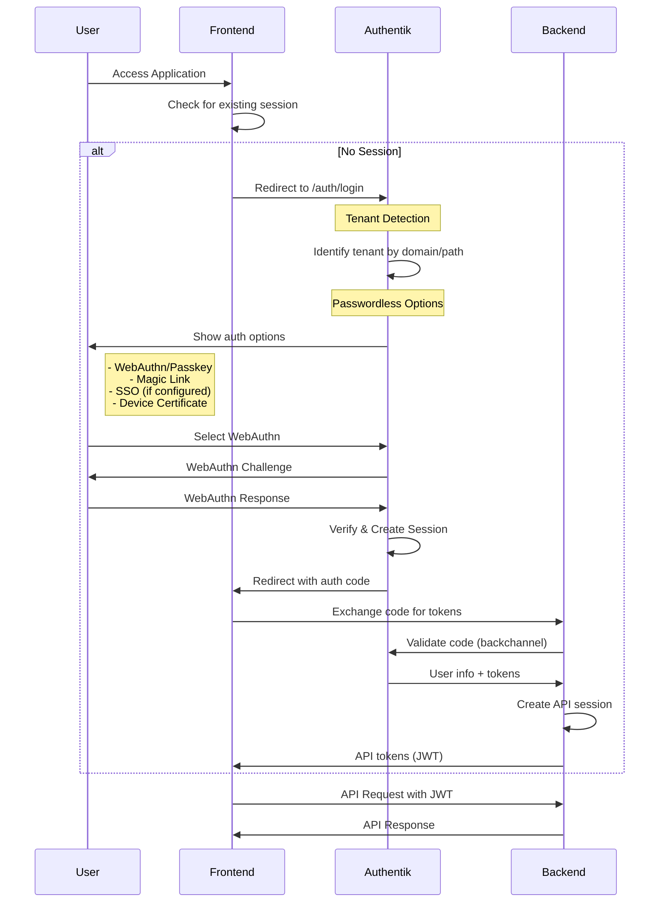

# Authentik Integration Architecture

## Overview

This document describes the recommended authentication architecture using Authentik as the central authentication provider for the nAI Backend v5.

## Architecture Diagram



## Authentication Flow

### 1. Initial Authentication (Passwordless)



### 2. Multi-Tenant Configuration

```python
# backend/src/auth/authentik_integration.py
from typing import Optional, Dict, Any
import httpx
from jose import jwt

class AuthentikIntegration:
    """
    Manages integration with Authentik for multi-tenant authentication.
    """
    
    def __init__(self, config: AuthentikConfig):
        self.base_url = config.base_url
        self.client_id = config.client_id
        self.client_secret = config.client_secret
        self.tenant_resolver = TenantResolver()
        
    async def exchange_code_for_token(
        self,
        code: str,
        redirect_uri: str,
        tenant_id: str
    ) -> TokenResponse:
        """
        Exchange Authentik authorization code for tokens.
        """
        # Get tenant-specific configuration
        tenant_config = await self._get_tenant_config(tenant_id)
        
        # Exchange code with Authentik
        async with httpx.AsyncClient() as client:
            response = await client.post(
                f"{self.base_url}/application/o/token/",
                data={
                    "grant_type": "authorization_code",
                    "code": code,
                    "redirect_uri": redirect_uri,
                    "client_id": tenant_config.client_id,
                    "client_secret": tenant_config.client_secret,
                }
            )
            
        if response.status_code != 200:
            raise AuthenticationError("Code exchange failed")
            
        token_data = response.json()
        
        # Validate and decode ID token
        id_token = self._validate_id_token(
            token_data["id_token"],
            tenant_config
        )
        
        # Create internal session
        session = await self._create_internal_session(
            user_info=id_token,
            tenant_id=tenant_id,
            access_token=token_data["access_token"]
        )
        
        return TokenResponse(
            access_token=session.access_token,
            refresh_token=session.refresh_token,
            expires_in=3600,
            user_info=id_token
        )
        
    def _validate_id_token(
        self,
        token: str,
        tenant_config: TenantConfig
    ) -> Dict[str, Any]:
        """
        Validate and decode Authentik ID token.
        """
        # Get Authentik's public keys
        jwks = self._get_authentik_jwks()
        
        # Validate token
        return jwt.decode(
            token,
            jwks,
            algorithms=["RS256"],
            audience=tenant_config.client_id,
            issuer=f"{self.base_url}/application/o/{tenant_config.slug}/"
        )
```

## Authentik Configuration

### 1. Tenant Setup

Each tenant in Authentik gets:

```yaml
# Authentik Provider Configuration
name: "Tenant A - OAuth2 Provider"
authorization_flow: "custom-passwordless-flow"
client_type: "confidential"
redirect_uris:
  - "https://tenant-a.app.com/auth/callback"
  - "https://api.app.com/auth/callback?tenant=tenant-a"

# Authentication Flow
authentication_flow:
  name: "Passwordless Authentication"
  stages:
    - identification_stage:
        user_fields: ["email", "username"]
        enrollment_flow: "passwordless-enrollment"
    
    - authenticator_validation_stage:
        device_classes:
          - "webauthn"    # Passkeys/FIDO2
          - "totp"        # Backup only
          - "static"      # Recovery codes
        webauthn_user_verification: "required"
    
    - user_login_stage:
        session_duration: "hours=8"
```

### 2. WebAuthn/Passkey Configuration

```python
# Authentik WebAuthn Configuration
WEBAUTHN_RP_ID = "app.com"
WEBAUTHN_RP_NAME = "nAI Platform"
WEBAUTHN_CHALLENGE_TIMEOUT = 60000
WEBAUTHN_USER_VERIFICATION = "required"
WEBAUTHN_ATTESTATION = "direct"

# Per-tenant WebAuthn settings
TENANT_WEBAUTHN_CONFIG = {
    "tenant_a": {
        "rp_id": "tenant-a.app.com",
        "require_resident_key": True,
        "authenticator_attachment": "platform"  # TPM/Secure Enclave
    }
}
```

### 3. Device Authentication Setup

```python
# backend/src/auth/device_auth.py
class DeviceAuthenticationManager:
    """
    Manages device-based authentication without passwords.
    """
    
    async def register_device(
        self,
        user_id: str,
        device_info: DeviceInfo,
        attestation: Optional[AttestationObject] = None
    ) -> DeviceRegistration:
        """
        Register a device for passwordless authentication.
        """
        # Generate device ID
        device_id = self._generate_device_id(device_info)
        
        # Store device attestation if provided (TPM/Secure Enclave)
        if attestation:
            await self._store_attestation(device_id, attestation)
            
        # Create device record
        device = Device(
            id=device_id,
            user_id=user_id,
            name=device_info.name,
            type=device_info.type,
            platform=device_info.platform,
            trusted=attestation is not None,
            last_seen=datetime.utcnow(),
            created_at=datetime.utcnow()
        )
        
        await self.db.save(device)
        
        # Generate device certificate for mutual TLS (optional)
        if device.trusted:
            cert = await self._generate_device_certificate(device)
            return DeviceRegistration(
                device_id=device_id,
                certificate=cert,
                type="certificate"
            )
            
        return DeviceRegistration(
            device_id=device_id,
            type="webauthn"
        )
```

## Backend Token Exchange Service

```python
# backend/src/auth/token_exchange.py
class TokenExchangeService:
    """
    Handles token exchange between Authentik and internal JWT tokens.
    """
    
    def __init__(self):
        self.authentik = AuthentikIntegration()
        self.jwt_manager = JWTManager()
        self.session_manager = SessionManager()
        
    async def exchange_authentik_token(
        self,
        authentik_token: str,
        tenant_id: str
    ) -> InternalTokenResponse:
        """
        Exchange Authentik token for internal API tokens.
        """
        # Validate Authentik token
        user_info = await self.authentik.introspect_token(
            token=authentik_token,
            tenant_id=tenant_id
        )
        
        if not user_info.active:
            raise TokenInvalidError()
            
        # Get or create internal user
        user = await self._get_or_create_user(
            external_id=user_info.sub,
            email=user_info.email,
            tenant_id=tenant_id,
            attributes=user_info.attributes
        )
        
        # Create internal tokens
        access_token = self.jwt_manager.create_access_token(
            user_id=user.id,
            tenant_id=tenant_id,
            scopes=user_info.scopes,
            session_id=user_info.session_id
        )
        
        refresh_token = self.jwt_manager.create_refresh_token(
            user_id=user.id,
            tenant_id=tenant_id,
            session_id=user_info.session_id
        )
        
        # Create session
        await self.session_manager.create_session(
            user_id=user.id,
            tenant_id=tenant_id,
            session_id=user_info.session_id,
            authentik_session=user_info.sid
        )
        
        return InternalTokenResponse(
            access_token=access_token,
            refresh_token=refresh_token,
            token_type="Bearer",
            expires_in=900  # 15 minutes
        )
```

## Security Considerations

### 1. Token Security

```python
# Token validation middleware
@app.middleware("http")
async def validate_token_middleware(request: Request, call_next):
    """
    Validates tokens and maintains security context.
    """
    # Skip for public endpoints
    if request.url.path in PUBLIC_ENDPOINTS:
        return await call_next(request)
        
    # Extract token
    token = extract_bearer_token(request)
    if not token:
        return JSONResponse(
            status_code=401,
            content={"error": "Missing authentication token"}
        )
        
    try:
        # Validate JWT
        payload = jwt_manager.decode_access_token(token)
        
        # Check if Authentik session still valid
        if not await authentik.validate_session(payload["sid"]):
            raise TokenRevokedError()
            
        # Set security context
        request.state.user_id = payload["sub"]
        request.state.tenant_id = payload["tenant_id"]
        request.state.session_id = payload["session_id"]
        
    except TokenExpiredError:
        # Attempt refresh
        # ...
        
    return await call_next(request)
```

### 2. Tenant Isolation

```python
# Ensure tenant isolation at API level
class TenantIsolationMiddleware:
    async def __call__(self, request: Request, call_next):
        # Get tenant from token
        tenant_id = request.state.tenant_id
        
        # Set tenant context for database queries
        set_tenant_context(tenant_id)
        
        # Validate tenant access
        if not await self.validate_tenant_access(
            user_id=request.state.user_id,
            tenant_id=tenant_id,
            resource=request.url.path
        ):
            return JSONResponse(
                status_code=403,
                content={"error": "Tenant access denied"}
            )
            
        return await call_next(request)
```

## Benefits of This Architecture

1. **No Passwords**: Completely passwordless with WebAuthn, Passkeys, and device certificates
2. **Multi-Tenant Ready**: Each tenant can have different auth providers and policies
3. **Enterprise SSO**: Support for SAML, OIDC, LDAP out of the box
4. **Security**: Authentik handles the complex auth flows securely
5. **Compliance**: Built-in audit logging and GDPR compliance
6. **Scalability**: Authentik can handle millions of users
7. **Maintenance**: Security updates handled by Authentik team

## Implementation Timeline

1. **Week 1-2**: Authentik setup and configuration
2. **Week 3-4**: Token exchange service
3. **Week 5-6**: WebAuthn/Device auth integration
4. **Week 7-8**: Multi-tenant configuration
5. **Week 9-10**: Testing and security audit

Total: **10 weeks** vs 6-12 months for custom implementation

---

This architecture provides enterprise-grade authentication without the complexity and security risks of building it yourself. Authentik handles the heavy lifting while you focus on your business logic.