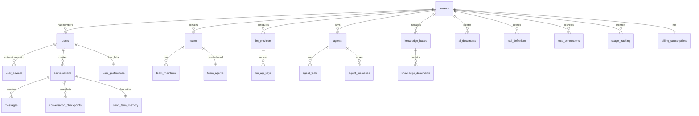

# Database Models Documentation - nAI Backend v5 Complete
## Enterprise AI Platform with Multi-LLM Support

## Executive Summary

This document defines the complete database schema for nAI Backend v5, an enterprise-grade AI platform featuring:
- **Multi-LLM Support** (OpenAI, Anthropic, Google Gemini, Azure OpenAI, Ollama)
- **LangGraph-based Agent System** with dynamic tool loading
- **Multi-tier Memory Architecture** (STM, LTM, Vector, Shared)
- **Knowledge Management** with Apache AGE graph database
- **Real-time Team Collaboration** via WebSockets
- **AI Document Creation** with TipTap integration
- **Passwordless Authentication** via Authentik

## Table of Contents

1. [Core Architecture](#core-architecture)
2. [Authentication & Security](#authentication--security)
3. [Tenant & User Management](#tenant--user-management)
4. [Multi-LLM Integration](#multi-llm-integration)
5. [Conversation & Messaging](#conversation--messaging)
6. [Memory Architecture](#memory-architecture)
7. [Agent System](#agent-system)
8. [Knowledge Management](#knowledge-management)
9. [Document System](#document-system)
10. [Team Collaboration](#team-collaboration)
11. [Tool & MCP Integration](#tool--mcp-integration)
12. [Flow Automation](#flow-automation)
13. [Usage & Billing](#usage--billing)
14. [Notification System](#notification-system)
15. [Audit & Compliance](#audit--compliance)

---

## Core Architecture

### Design Principles

1. **NO PASSWORD STORAGE** - All authentication via Authentik
2. **Multi-Tenant by Design** - Complete isolation between tenants
3. **Real-time First** - WebSocket-based communication
4. **AI-Native** - Built for LLM and agent workflows
5. **Security First** - Encrypted API keys, row-level security

### Base Models

```sql
-- Base model for all tables
CREATE TYPE base_model AS (
    id UUID DEFAULT gen_random_uuid(),
    created_at TIMESTAMP NOT NULL DEFAULT NOW(),
    updated_at TIMESTAMP NOT NULL DEFAULT NOW()
);

-- Tenant-aware base model
CREATE TYPE tenant_aware_model AS (
    -- Includes all base_model fields
    tenant_id UUID NOT NULL
);
```

### Entity Relationship Overview



---

## Authentication & Security

### users
**NO PASSWORD FIELD - Authentication via Authentik only**

```sql
CREATE TABLE users (
    id UUID PRIMARY KEY DEFAULT gen_random_uuid(),
    
    -- Authentik Integration
    external_id VARCHAR(255) UNIQUE NOT NULL, -- Authentik user ID
    email VARCHAR(255) UNIQUE NOT NULL,
    username VARCHAR(255) UNIQUE,
    
    -- Profile
    full_name VARCHAR(255),
    avatar_url TEXT,
    language VARCHAR(10) DEFAULT 'en',
    timezone VARCHAR(50) DEFAULT 'UTC',
    
    -- Status
    is_active BOOLEAN DEFAULT true,
    is_verified BOOLEAN DEFAULT false,
    last_seen_at TIMESTAMP,
    
    -- Metadata
    metadata JSONB DEFAULT '{}',
    
    -- Audit
    created_at TIMESTAMP NOT NULL DEFAULT NOW(),
    updated_at TIMESTAMP NOT NULL DEFAULT NOW(),
    
    -- Indexes
    INDEX idx_users_email (email),
    INDEX idx_users_external_id (external_id)
);
```

### user_devices
**Device-based authentication only**

```sql
CREATE TABLE user_devices (
    id UUID PRIMARY KEY DEFAULT gen_random_uuid(),
    user_id UUID NOT NULL REFERENCES users(id) ON DELETE CASCADE,
    
    -- Device Info
    device_name VARCHAR(255) NOT NULL,
    device_type VARCHAR(50) NOT NULL, -- webauthn, passkey, certificate
    device_id VARCHAR(255) UNIQUE NOT NULL,
    
    -- Authentication
    credential_id VARCHAR(255) UNIQUE,
    public_key TEXT,
    attestation_object JSONB,
    
    -- Trust
    is_trusted BOOLEAN DEFAULT false,
    trust_score FLOAT DEFAULT 0.0,
    
    -- Usage
    last_used_at TIMESTAMP,
    use_count INTEGER DEFAULT 0,
    
    -- Status
    is_active BOOLEAN DEFAULT true,
    
    -- Metadata
    user_agent TEXT,
    metadata JSONB DEFAULT '{}',
    
    -- Audit
    created_at TIMESTAMP NOT NULL DEFAULT NOW(),
    updated_at TIMESTAMP NOT NULL DEFAULT NOW(),
    
    -- Indexes
    INDEX idx_user_devices_user_id (user_id),
    INDEX idx_user_devices_device_id (device_id)
);
```

---

## Tenant & User Management

### tenants

```sql
CREATE TABLE tenants (
    id UUID PRIMARY KEY DEFAULT gen_random_uuid(),
    
    -- Identity
    name VARCHAR(255) NOT NULL,
    slug VARCHAR(255) UNIQUE NOT NULL,
    domain VARCHAR(255),
    
    -- Organization
    industry VARCHAR(100),
    company_size VARCHAR(50),
    country VARCHAR(2),
    
    -- Subscription
    plan_type VARCHAR(50) DEFAULT 'trial', -- trial, starter, professional, enterprise
    trial_ends_at TIMESTAMP,
    subscription_ends_at TIMESTAMP,
    
    -- Limits (based on plan)
    max_users INTEGER DEFAULT 5,
    max_teams INTEGER DEFAULT 1,
    max_agents INTEGER DEFAULT 3,
    max_monthly_tokens INTEGER DEFAULT 1000000,
    max_storage_gb INTEGER DEFAULT 10,
    
    -- Configuration
    settings JSONB DEFAULT '{}',
    features JSONB DEFAULT '[]', -- Enabled features
    
    -- Status
    is_active BOOLEAN DEFAULT true,
    activation_date TIMESTAMP,
    
    -- Metadata
    metadata JSONB DEFAULT '{}',
    
    -- Audit
    created_at TIMESTAMP NOT NULL DEFAULT NOW(),
    updated_at TIMESTAMP NOT NULL DEFAULT NOW(),
    
    -- Indexes
    INDEX idx_tenants_slug (slug),
    INDEX idx_tenants_is_active (is_active)
);
```

### tenant_users

```sql
CREATE TABLE tenant_users (
    id UUID PRIMARY KEY DEFAULT gen_random_uuid(),
    tenant_id UUID NOT NULL REFERENCES tenants(id) ON DELETE CASCADE,
    user_id UUID NOT NULL REFERENCES users(id) ON DELETE CASCADE,
    
    -- Role & Permissions
    role VARCHAR(50) NOT NULL DEFAULT 'member', -- owner, admin, member, viewer
    permissions JSONB DEFAULT '[]', -- Additional permissions
    
    -- Status
    is_active BOOLEAN DEFAULT true,
    joined_at TIMESTAMP NOT NULL DEFAULT NOW(),
    
    -- Invitation
    invited_by UUID REFERENCES users(id),
    invitation_accepted_at TIMESTAMP,
    
    -- Constraints
    UNIQUE(tenant_id, user_id),
    
    -- Indexes
    INDEX idx_tenant_users_tenant_id (tenant_id),
    INDEX idx_tenant_users_user_id (user_id)
);
```

---

## Multi-LLM Integration

### llm_providers

```sql
CREATE TABLE llm_providers (
    id UUID PRIMARY KEY DEFAULT gen_random_uuid(),
    tenant_id UUID NOT NULL REFERENCES tenants(id) ON DELETE CASCADE,
    
    -- Provider Info
    provider_type VARCHAR(50) NOT NULL, -- openai, anthropic, google, azure, ollama
    display_name VARCHAR(255) NOT NULL,
    is_default BOOLEAN DEFAULT false,
    
    -- Configuration
    base_url TEXT, -- For Azure/Ollama custom endpoints
    api_version VARCHAR(50),
    region VARCHAR(50), -- For Azure
    
    -- Models
    available_models JSONB DEFAULT '[]', -- List of model IDs
    default_model VARCHAR(100),
    
    -- Limits
    rate_limit_rpm INTEGER, -- Requests per minute
    rate_limit_tpd INTEGER, -- Tokens per day
    
    -- Status
    is_active BOOLEAN DEFAULT true,
    last_health_check TIMESTAMP,
    health_status VARCHAR(50) DEFAULT 'unknown', -- healthy, degraded, down
    
    -- Metadata
    metadata JSONB DEFAULT '{}',
    
    -- Audit
    created_by UUID NOT NULL REFERENCES users(id),
    created_at TIMESTAMP NOT NULL DEFAULT NOW(),
    updated_at TIMESTAMP NOT NULL DEFAULT NOW(),
    
    -- Constraints
    UNIQUE(tenant_id, provider_type, base_url),
    
    -- Indexes
    INDEX idx_llm_providers_tenant_id (tenant_id),
    INDEX idx_llm_providers_is_active (is_active)
);
```

### llm_api_keys

```sql
CREATE TABLE llm_api_keys (
    id UUID PRIMARY KEY DEFAULT gen_random_uuid(),
    provider_id UUID NOT NULL REFERENCES llm_providers(id) ON DELETE CASCADE,
    
    -- Encrypted Storage
    key_name VARCHAR(255) NOT NULL,
    encrypted_key TEXT NOT NULL, -- AES-256 encrypted
    key_hint VARCHAR(20), -- Last 4 characters for identification
    encryption_key_id VARCHAR(100), -- Reference to KMS key
    
    -- Usage Tracking
    total_requests INTEGER DEFAULT 0,
    total_tokens INTEGER DEFAULT 0,
    total_cost DECIMAL(10, 4) DEFAULT 0.0,
    
    -- Status
    is_active BOOLEAN DEFAULT true,
    expires_at TIMESTAMP,
    last_used_at TIMESTAMP,
    
    -- Metadata
    metadata JSONB DEFAULT '{}',
    
    -- Audit
    created_by UUID NOT NULL REFERENCES users(id),
    created_at TIMESTAMP NOT NULL DEFAULT NOW(),
    rotated_at TIMESTAMP,
    
    -- Indexes
    INDEX idx_llm_api_keys_provider_id (provider_id),
    INDEX idx_llm_api_keys_is_active (is_active)
);
```

---

## Conversation & Messaging

### conversations

```sql
CREATE TABLE conversations (
    id UUID PRIMARY KEY DEFAULT gen_random_uuid(),
    tenant_id UUID NOT NULL REFERENCES tenants(id) ON DELETE CASCADE,
    
    -- Ownership
    user_id UUID NOT NULL REFERENCES users(id),
    team_id UUID REFERENCES teams(id),
    
    -- Identity
    title VARCHAR(500),
    summary TEXT,
    
    -- Agent Assignment
    agent_id UUID REFERENCES agents(id),
    
    -- Configuration
    llm_provider_id UUID REFERENCES llm_providers(id),
    model_settings JSONB DEFAULT '{
        "model": null,
        "temperature": 0.7,
        "max_tokens": 4096,
        "top_p": 1.0
    }',
    
    -- Memory Management
    message_count INTEGER DEFAULT 0,
    checkpoint_frequency INTEGER DEFAULT 50, -- Create checkpoint every N messages
    last_checkpoint_at TIMESTAMP,
    
    -- WebSocket
    ws_channel_id VARCHAR(255), -- For real-time updates
    
    -- Status
    is_active BOOLEAN DEFAULT true,
    is_archived BOOLEAN DEFAULT false,
    
    -- Metadata
    tags JSONB DEFAULT '[]',
    metadata JSONB DEFAULT '{}',
    
    -- Timestamps
    created_at TIMESTAMP NOT NULL DEFAULT NOW(),
    updated_at TIMESTAMP NOT NULL DEFAULT NOW(),
    last_message_at TIMESTAMP,
    
    -- Indexes
    INDEX idx_conversations_tenant_id (tenant_id),
    INDEX idx_conversations_user_id (user_id),
    INDEX idx_conversations_team_id (team_id),
    INDEX idx_conversations_agent_id (agent_id),
    INDEX idx_conversations_last_message_at (last_message_at DESC)
);
```

### messages

```sql
CREATE TABLE messages (
    id UUID PRIMARY KEY DEFAULT gen_random_uuid(),
    conversation_id UUID NOT NULL REFERENCES conversations(id) ON DELETE CASCADE,
    
    -- Content
    role VARCHAR(50) NOT NULL, -- user, assistant, system, tool
    content TEXT NOT NULL,
    
    -- LLM Details
    model_used VARCHAR(100),
    provider_id UUID REFERENCES llm_providers(id),
    
    -- Token Usage
    prompt_tokens INTEGER,
    completion_tokens INTEGER,
    total_tokens INTEGER,
    
    -- Tool Usage
    tool_calls JSONB, -- Array of tool calls
    tool_results JSONB, -- Tool execution results
    
    -- Threading
    parent_message_id UUID REFERENCES messages(id),
    
    -- WebSocket
    ws_delivered BOOLEAN DEFAULT false,
    ws_delivered_at TIMESTAMP,
    
    -- Status
    is_visible BOOLEAN DEFAULT true,
    is_edited BOOLEAN DEFAULT false,
    error JSONB,
    
    -- Metadata
    metadata JSONB DEFAULT '{}',
    
    -- Timestamps
    created_at TIMESTAMP NOT NULL DEFAULT NOW(),
    edited_at TIMESTAMP,
    
    -- Indexes
    INDEX idx_messages_conversation_id (conversation_id),
    INDEX idx_messages_created_at (created_at),
    INDEX idx_messages_parent_id (parent_message_id)
);
```

### conversation_checkpoints

```sql
CREATE TABLE conversation_checkpoints (
    id UUID PRIMARY KEY DEFAULT gen_random_uuid(),
    conversation_id UUID NOT NULL REFERENCES conversations(id) ON DELETE CASCADE,
    
    -- Checkpoint Info
    checkpoint_number INTEGER NOT NULL,
    message_count INTEGER NOT NULL,
    
    -- Summary
    summary TEXT NOT NULL,
    key_points JSONB DEFAULT '[]',
    entities_mentioned JSONB DEFAULT '[]',
    
    -- Token Savings
    original_tokens INTEGER,
    summary_tokens INTEGER,
    compression_ratio FLOAT,
    
    -- Metadata
    metadata JSONB DEFAULT '{}',
    
    -- Timestamps
    created_at TIMESTAMP NOT NULL DEFAULT NOW(),
    
    -- Constraints
    UNIQUE(conversation_id, checkpoint_number),
    
    -- Indexes
    INDEX idx_checkpoints_conversation_id (conversation_id),
    INDEX idx_checkpoints_created_at (created_at)
);
```

---

## Memory Architecture

### short_term_memory
**Active memory for ongoing conversations**

```sql
CREATE TABLE short_term_memory (
    id UUID PRIMARY KEY DEFAULT gen_random_uuid(),
    conversation_id UUID NOT NULL REFERENCES conversations(id) ON DELETE CASCADE,
    
    -- Memory Content
    memory_type VARCHAR(50) NOT NULL, -- context, fact, instruction
    content TEXT NOT NULL,
    importance FLOAT DEFAULT 0.5, -- 0.0 to 1.0
    
    -- Lifecycle
    expires_at TIMESTAMP NOT NULL, -- Auto-cleanup after inactivity
    accessed_count INTEGER DEFAULT 0,
    last_accessed_at TIMESTAMP,
    
    -- Status
    is_active BOOLEAN DEFAULT true,
    
    -- Metadata
    source VARCHAR(50), -- user_input, system_extraction, tool_result
    metadata JSONB DEFAULT '{}',
    
    -- Timestamps
    created_at TIMESTAMP NOT NULL DEFAULT NOW(),
    
    -- Indexes
    INDEX idx_stm_conversation_id (conversation_id),
    INDEX idx_stm_expires_at (expires_at),
    INDEX idx_stm_importance (importance DESC)
);
```

### long_term_memory
**Persistent memory from summarized conversations**

```sql
CREATE TABLE long_term_memory (
    id UUID PRIMARY KEY DEFAULT gen_random_uuid(),
    tenant_id UUID NOT NULL REFERENCES tenants(id) ON DELETE CASCADE,
    user_id UUID NOT NULL REFERENCES users(id),
    
    -- Memory Content
    memory_type VARCHAR(50) NOT NULL, -- fact, preference, pattern, knowledge
    content TEXT NOT NULL,
    
    -- Source
    source_type VARCHAR(50), -- conversation, document, explicit
    source_id UUID, -- Reference to source
    conversation_ids UUID[] DEFAULT '{}', -- Related conversations
    
    -- Importance & Confidence
    importance FLOAT DEFAULT 0.5,
    confidence FLOAT DEFAULT 0.8,
    reinforcement_count INTEGER DEFAULT 1, -- Times this memory was reinforced
    
    -- Vector Embedding
    embedding_id VARCHAR(255), -- Milvus vector ID
    
    -- Access Pattern
    access_count INTEGER DEFAULT 0,
    last_accessed_at TIMESTAMP,
    
    -- Status
    is_active BOOLEAN DEFAULT true,
    
    -- Metadata
    tags JSONB DEFAULT '[]',
    metadata JSONB DEFAULT '{}',
    
    -- Timestamps
    created_at TIMESTAMP NOT NULL DEFAULT NOW(),
    updated_at TIMESTAMP NOT NULL DEFAULT NOW(),
    
    -- Indexes
    INDEX idx_ltm_tenant_user (tenant_id, user_id),
    INDEX idx_ltm_memory_type (memory_type),
    INDEX idx_ltm_importance (importance DESC)
);
```

### user_preferences
**Global user preferences and personalization**

```sql
CREATE TABLE user_preferences (
    id UUID PRIMARY KEY DEFAULT gen_random_uuid(),
    user_id UUID NOT NULL REFERENCES users(id) ON DELETE CASCADE,
    
    -- Communication Preferences
    preferred_name VARCHAR(255), -- "Call me Timmy instead of Tim"
    communication_style VARCHAR(50), -- formal, casual, technical
    response_length VARCHAR(50), -- concise, detailed, balanced
    
    -- Technical Preferences
    preferred_languages JSONB DEFAULT '[]', -- ["rust", "java"]
    expertise_areas JSONB DEFAULT '[]', -- ["backend", "distributed-systems"]
    avoided_topics JSONB DEFAULT '[]',
    
    -- Behavioral Preferences
    learning_style VARCHAR(50), -- visual, textual, examples
    decision_style VARCHAR(50), -- analytical, intuitive, collaborative
    
    -- UI/UX Preferences
    theme VARCHAR(50) DEFAULT 'system',
    notification_preferences JSONB DEFAULT '{}',
    
    -- Agent Preferences
    preferred_agent_ids UUID[] DEFAULT '{}',
    agent_interaction_style JSONB DEFAULT '{}',
    
    -- Privacy
    memory_retention_days INTEGER DEFAULT 365,
    allow_memory_sharing BOOLEAN DEFAULT false,
    
    -- Metadata
    custom_preferences JSONB DEFAULT '{}',
    
    -- Timestamps
    created_at TIMESTAMP NOT NULL DEFAULT NOW(),
    updated_at TIMESTAMP NOT NULL DEFAULT NOW(),
    
    -- Constraints
    UNIQUE(user_id),
    
    -- Indexes
    INDEX idx_user_preferences_user_id (user_id)
);
```

### memory_shares
**Shared memory between team members**

```sql
CREATE TABLE memory_shares (
    id UUID PRIMARY KEY DEFAULT gen_random_uuid(),
    tenant_id UUID NOT NULL REFERENCES tenants(id) ON DELETE CASCADE,
    
    -- Source Memory
    memory_type VARCHAR(50) NOT NULL, -- ltm, knowledge, document
    memory_id UUID NOT NULL,
    
    -- Sharing
    shared_with_type VARCHAR(50) NOT NULL, -- team, user, role
    shared_with_id UUID NOT NULL,
    
    -- Permissions
    can_read BOOLEAN DEFAULT true,
    can_modify BOOLEAN DEFAULT false,
    
    -- Lifecycle
    expires_at TIMESTAMP,
    
    -- Metadata
    shared_by UUID NOT NULL REFERENCES users(id),
    share_reason TEXT,
    metadata JSONB DEFAULT '{}',
    
    -- Timestamps
    created_at TIMESTAMP NOT NULL DEFAULT NOW(),
    
    -- Indexes
    INDEX idx_memory_shares_memory (memory_type, memory_id),
    INDEX idx_memory_shares_shared_with (shared_with_type, shared_with_id)
);
```

---

## Agent System

### agents

```sql
CREATE TABLE agents (
    id UUID PRIMARY KEY DEFAULT gen_random_uuid(),
    tenant_id UUID NOT NULL REFERENCES tenants(id) ON DELETE CASCADE,
    
    -- Identity
    name VARCHAR(255) NOT NULL,
    display_name VARCHAR(255) NOT NULL,
    description TEXT,
    avatar_url TEXT,
    
    -- Type & Purpose
    agent_type VARCHAR(50) NOT NULL, -- general, specialist, coordinator, team
    specialization VARCHAR(100), -- coding, research, writing, analysis
    
    -- LangGraph Configuration
    graph_definition JSONB NOT NULL, -- LangGraph flow definition
    default_llm_provider_id UUID REFERENCES llm_providers(id),
    model_preferences JSONB DEFAULT '{}',
    
    -- Capabilities
    capabilities JSONB DEFAULT '[]', -- ['web_search', 'code_execution', 'file_access']
    tool_ids UUID[] DEFAULT '{}', -- Available tools
    mcp_connection_ids UUID[] DEFAULT '{}', -- MCP servers
    
    -- Behavior
    system_prompt TEXT,
    temperature FLOAT DEFAULT 0.7,
    response_style VARCHAR(50), -- concise, detailed, creative
    
    -- Knowledge Access
    knowledge_base_ids UUID[] DEFAULT '{}',
    memory_access_level VARCHAR(50) DEFAULT 'conversation', -- none, conversation, user, team
    
    -- Team Assignment
    team_id UUID REFERENCES teams(id), -- For team-specific agents
    
    -- Access Control
    is_public BOOLEAN DEFAULT false,
    allowed_roles JSONB DEFAULT '["admin", "member"]',
    
    -- Status
    is_active BOOLEAN DEFAULT true,
    
    -- Metrics
    total_conversations INTEGER DEFAULT 0,
    satisfaction_score FLOAT DEFAULT 0.0,
    avg_response_time_ms INTEGER DEFAULT 0,
    
    -- Metadata
    tags JSONB DEFAULT '[]',
    metadata JSONB DEFAULT '{}',
    
    -- Audit
    created_by UUID NOT NULL REFERENCES users(id),
    created_at TIMESTAMP NOT NULL DEFAULT NOW(),
    updated_at TIMESTAMP NOT NULL DEFAULT NOW(),
    
    -- Indexes
    INDEX idx_agents_tenant_id (tenant_id),
    INDEX idx_agents_team_id (team_id),
    INDEX idx_agents_agent_type (agent_type),
    INDEX idx_agents_is_active (is_active)
);
```

### agent_memories
**Agent-specific learned memories**

```sql
CREATE TABLE agent_memories (
    id UUID PRIMARY KEY DEFAULT gen_random_uuid(),
    agent_id UUID NOT NULL REFERENCES agents(id) ON DELETE CASCADE,
    tenant_id UUID NOT NULL REFERENCES tenants(id) ON DELETE CASCADE,
    
    -- Context
    user_id UUID REFERENCES users(id),
    team_id UUID REFERENCES teams(id),
    conversation_id UUID REFERENCES conversations(id),
    
    -- Memory Content
    memory_type VARCHAR(50) NOT NULL, -- learning, pattern, feedback, optimization
    content TEXT NOT NULL,
    
    -- Learning Metrics
    confidence FLOAT DEFAULT 0.5,
    usefulness_score FLOAT DEFAULT 0.0,
    application_count INTEGER DEFAULT 0,
    
    -- Lifecycle
    is_active BOOLEAN DEFAULT true,
    expires_at TIMESTAMP,
    
    -- Metadata
    source VARCHAR(50), -- user_feedback, self_learning, system
    metadata JSONB DEFAULT '{}',
    
    -- Timestamps
    created_at TIMESTAMP NOT NULL DEFAULT NOW(),
    last_applied_at TIMESTAMP,
    
    -- Indexes
    INDEX idx_agent_memories_agent_id (agent_id),
    INDEX idx_agent_memories_user_id (user_id),
    INDEX idx_agent_memories_confidence (confidence DESC)
);
```

### agent_tools
**Tools available to agents**

```sql
CREATE TABLE agent_tools (
    id UUID PRIMARY KEY DEFAULT gen_random_uuid(),
    agent_id UUID NOT NULL REFERENCES agents(id) ON DELETE CASCADE,
    tool_id UUID NOT NULL REFERENCES tool_definitions(id),
    
    -- Configuration
    is_enabled BOOLEAN DEFAULT true,
    custom_parameters JSONB DEFAULT '{}',
    rate_limit_override INTEGER,
    
    -- Usage
    usage_count INTEGER DEFAULT 0,
    last_used_at TIMESTAMP,
    
    -- Constraints
    UNIQUE(agent_id, tool_id),
    
    -- Indexes
    INDEX idx_agent_tools_agent_id (agent_id),
    INDEX idx_agent_tools_tool_id (tool_id)
);
```

---

## Knowledge Management

### knowledge_bases

```sql
CREATE TABLE knowledge_bases (
    id UUID PRIMARY KEY DEFAULT gen_random_uuid(),
    tenant_id UUID NOT NULL REFERENCES tenants(id) ON DELETE CASCADE,
    
    -- Identity
    name VARCHAR(255) NOT NULL,
    description TEXT,
    kb_type VARCHAR(50) NOT NULL, -- general, domain, team, personal
    
    -- Organization
    parent_kb_id UUID REFERENCES knowledge_bases(id),
    category VARCHAR(100),
    
    -- Vector Configuration
    collection_name VARCHAR(255) UNIQUE NOT NULL, -- Milvus collection
    embedding_model VARCHAR(100) DEFAULT 'text-embedding-3-small',
    chunk_size INTEGER DEFAULT 1000,
    chunk_overlap INTEGER DEFAULT 200,
    
    -- Access Control
    access_level VARCHAR(50) DEFAULT 'private', -- private, team, tenant
    owner_type VARCHAR(50) NOT NULL, -- user, team, tenant
    owner_id UUID NOT NULL,
    
    -- Graph Integration
    enable_knowledge_graph BOOLEAN DEFAULT true,
    graph_namespace VARCHAR(255), -- Apache AGE namespace
    
    -- Status
    is_active BOOLEAN DEFAULT true,
    last_indexed_at TIMESTAMP,
    
    -- Metrics
    document_count INTEGER DEFAULT 0,
    total_chunks INTEGER DEFAULT 0,
    total_tokens INTEGER DEFAULT 0,
    query_count INTEGER DEFAULT 0,
    
    -- Metadata
    tags JSONB DEFAULT '[]',
    metadata JSONB DEFAULT '{}',
    
    -- Audit
    created_by UUID NOT NULL REFERENCES users(id),
    created_at TIMESTAMP NOT NULL DEFAULT NOW(),
    updated_at TIMESTAMP NOT NULL DEFAULT NOW(),
    
    -- Indexes
    INDEX idx_knowledge_bases_tenant_id (tenant_id),
    INDEX idx_knowledge_bases_owner (owner_type, owner_id),
    INDEX idx_knowledge_bases_access_level (access_level)
);
```

### knowledge_documents

```sql
CREATE TABLE knowledge_documents (
    id UUID PRIMARY KEY DEFAULT gen_random_uuid(),
    kb_id UUID NOT NULL REFERENCES knowledge_bases(id) ON DELETE CASCADE,
    tenant_id UUID NOT NULL REFERENCES tenants(id) ON DELETE CASCADE,
    
    -- Document Info
    title VARCHAR(500) NOT NULL,
    source_type VARCHAR(50) NOT NULL, -- upload, url, api, sharepoint, gdrive
    source_url TEXT,
    file_type VARCHAR(50),
    file_size_bytes BIGINT,
    
    -- Content
    raw_content TEXT,
    processed_content TEXT,
    summary TEXT,
    
    -- Processing
    processing_status VARCHAR(50) DEFAULT 'pending', -- pending, processing, completed, failed
    processing_error TEXT,
    chunk_count INTEGER DEFAULT 0,
    
    -- Permissions (for external sources)
    source_permissions JSONB DEFAULT '{}', -- User/group permissions from source
    
    -- Graph Integration
    graph_node_id VARCHAR(255), -- Apache AGE node ID
    extracted_entities JSONB DEFAULT '[]',
    extracted_relationships JSONB DEFAULT '[]',
    
    -- Metadata
    author VARCHAR(255),
    created_date TIMESTAMP,
    modified_date TIMESTAMP,
    language VARCHAR(10),
    custom_metadata JSONB DEFAULT '{}',
    
    -- Audit
    uploaded_by UUID REFERENCES users(id),
    created_at TIMESTAMP NOT NULL DEFAULT NOW(),
    updated_at TIMESTAMP NOT NULL DEFAULT NOW(),
    last_accessed_at TIMESTAMP,
    
    -- Indexes
    INDEX idx_knowledge_documents_kb_id (kb_id),
    INDEX idx_knowledge_documents_source_type (source_type),
    INDEX idx_knowledge_documents_processing_status (processing_status)
);
```

### knowledge_graph_nodes
**Apache AGE integration for knowledge graph**

```sql
-- This is conceptual - Apache AGE uses its own graph storage
-- But we track references here
CREATE TABLE knowledge_graph_nodes (
    id UUID PRIMARY KEY DEFAULT gen_random_uuid(),
    tenant_id UUID NOT NULL REFERENCES tenants(id) ON DELETE CASCADE,
    kb_id UUID NOT NULL REFERENCES knowledge_bases(id) ON DELETE CASCADE,
    
    -- Graph Reference
    graph_node_id VARCHAR(255) NOT NULL, -- AGE internal ID
    node_type VARCHAR(100) NOT NULL, -- document, entity, concept
    node_label VARCHAR(255) NOT NULL,
    
    -- Source
    source_type VARCHAR(50), -- document, user_defined, extracted
    source_id UUID,
    
    -- Properties (stored in AGE, cached here)
    properties JSONB DEFAULT '{}',
    
    -- Metadata
    created_at TIMESTAMP NOT NULL DEFAULT NOW(),
    
    -- Indexes
    INDEX idx_graph_nodes_tenant_kb (tenant_id, kb_id),
    INDEX idx_graph_nodes_type (node_type)
);
```

---

## Document System

### ai_documents
**AI-assisted document creation with TipTap**

```sql
CREATE TABLE ai_documents (
    id UUID PRIMARY KEY DEFAULT gen_random_uuid(),
    tenant_id UUID NOT NULL REFERENCES tenants(id) ON DELETE CASCADE,
    
    -- Ownership
    owner_type VARCHAR(50) NOT NULL, -- user, team
    owner_id UUID NOT NULL,
    
    -- Document Info
    title VARCHAR(500) NOT NULL,
    document_type VARCHAR(50), -- article, report, proposal, email
    
    -- Content (TipTap JSON)
    content JSONB NOT NULL, -- TipTap editor content
    plain_text TEXT, -- Extracted plain text
    word_count INTEGER DEFAULT 0,
    
    -- AI Assistance
    ai_session_id UUID, -- Track AI assistance session
    ai_contributions JSONB DEFAULT '[]', -- Track AI edits
    human_ai_ratio FLOAT, -- Human vs AI content ratio
    
    -- Collaboration
    is_shared BOOLEAN DEFAULT false,
    share_settings JSONB DEFAULT '{}',
    
    -- Versioning
    version INTEGER DEFAULT 1,
    parent_version_id UUID REFERENCES ai_documents(id),
    
    -- Publishing
    is_published BOOLEAN DEFAULT false,
    published_at TIMESTAMP,
    published_url TEXT,
    
    -- WebSocket
    ws_document_id VARCHAR(255), -- For real-time collaboration
    active_editors JSONB DEFAULT '[]', -- Currently editing users
    
    -- Metadata
    tags JSONB DEFAULT '[]',
    metadata JSONB DEFAULT '{}',
    
    -- Audit
    created_by UUID NOT NULL REFERENCES users(id),
    created_at TIMESTAMP NOT NULL DEFAULT NOW(),
    updated_at TIMESTAMP NOT NULL DEFAULT NOW(),
    last_edited_by UUID REFERENCES users(id),
    
    -- Indexes
    INDEX idx_ai_documents_tenant_id (tenant_id),
    INDEX idx_ai_documents_owner (owner_type, owner_id),
    INDEX idx_ai_documents_ws_id (ws_document_id)
);
```

### ai_document_sessions
**AI collaboration sessions for documents**

```sql
CREATE TABLE ai_document_sessions (
    id UUID PRIMARY KEY DEFAULT gen_random_uuid(),
    document_id UUID NOT NULL REFERENCES ai_documents(id) ON DELETE CASCADE,
    user_id UUID NOT NULL REFERENCES users(id),
    
    -- Session Info
    session_type VARCHAR(50), -- creation, editing, review
    agent_id UUID REFERENCES agents(id),
    
    -- Interaction History
    interactions JSONB DEFAULT '[]', -- Array of user/AI interactions
    total_interactions INTEGER DEFAULT 0,
    
    -- AI Usage
    total_tokens_used INTEGER DEFAULT 0,
    suggestions_accepted INTEGER DEFAULT 0,
    suggestions_rejected INTEGER DEFAULT 0,
    
    -- Timing
    started_at TIMESTAMP NOT NULL DEFAULT NOW(),
    ended_at TIMESTAMP,
    duration_seconds INTEGER,
    
    -- Metadata
    metadata JSONB DEFAULT '{}',
    
    -- Indexes
    INDEX idx_ai_sessions_document_id (document_id),
    INDEX idx_ai_sessions_user_id (user_id)
);
```

---

## Team Collaboration

### teams

```sql
CREATE TABLE teams (
    id UUID PRIMARY KEY DEFAULT gen_random_uuid(),
    tenant_id UUID NOT NULL REFERENCES tenants(id) ON DELETE CASCADE,
    
    -- Identity
    name VARCHAR(255) NOT NULL,
    slug VARCHAR(255) NOT NULL,
    description TEXT,
    avatar_url TEXT,
    
    -- Team Agent
    team_agent_id UUID REFERENCES agents(id), -- Dedicated team agent
    
    -- Settings
    settings JSONB DEFAULT '{
        "notifications": true,
        "auto_share_conversations": false,
        "default_share_permission": "read"
    }',
    
    -- WebSocket
    ws_channel_id VARCHAR(255) UNIQUE, -- Team real-time channel
    
    -- Status
    is_active BOOLEAN DEFAULT true,
    
    -- Metrics
    member_count INTEGER DEFAULT 0,
    active_conversations INTEGER DEFAULT 0,
    
    -- Metadata
    metadata JSONB DEFAULT '{}',
    
    -- Audit
    created_by UUID NOT NULL REFERENCES users(id),
    created_at TIMESTAMP NOT NULL DEFAULT NOW(),
    updated_at TIMESTAMP NOT NULL DEFAULT NOW(),
    
    -- Constraints
    UNIQUE(tenant_id, slug),
    
    -- Indexes
    INDEX idx_teams_tenant_id (tenant_id),
    INDEX idx_teams_slug (slug)
);
```

### team_members

```sql
CREATE TABLE team_members (
    id UUID PRIMARY KEY DEFAULT gen_random_uuid(),
    team_id UUID NOT NULL REFERENCES teams(id) ON DELETE CASCADE,
    user_id UUID NOT NULL REFERENCES users(id) ON DELETE CASCADE,
    
    -- Role & Permissions
    role VARCHAR(50) NOT NULL DEFAULT 'member', -- owner, admin, member, viewer
    permissions JSONB DEFAULT '[]',
    
    -- Status
    is_active BOOLEAN DEFAULT true,
    joined_at TIMESTAMP NOT NULL DEFAULT NOW(),
    
    -- Invitation
    invited_by UUID REFERENCES users(id),
    
    -- Constraints
    UNIQUE(team_id, user_id),
    
    -- Indexes
    INDEX idx_team_members_team_id (team_id),
    INDEX idx_team_members_user_id (user_id)
);
```

### team_resources
**Shared team resources**

```sql
CREATE TABLE team_resources (
    id UUID PRIMARY KEY DEFAULT gen_random_uuid(),
    team_id UUID NOT NULL REFERENCES teams(id) ON DELETE CASCADE,
    
    -- Resource Reference
    resource_type VARCHAR(50) NOT NULL, -- conversation, document, agent, prompt
    resource_id UUID NOT NULL,
    
    -- Sharing
    shared_by UUID NOT NULL REFERENCES users(id),
    shared_at TIMESTAMP NOT NULL DEFAULT NOW(),
    
    -- Permissions
    team_permissions JSONB DEFAULT '{"read": true, "write": false}',
    
    -- Metadata
    notes TEXT,
    tags JSONB DEFAULT '[]',
    
    -- Constraints
    UNIQUE(team_id, resource_type, resource_id),
    
    -- Indexes
    INDEX idx_team_resources_team_id (team_id),
    INDEX idx_team_resources_resource (resource_type, resource_id)
);
```

---

## Tool & MCP Integration

### tool_definitions

```sql
CREATE TABLE tool_definitions (
    id UUID PRIMARY KEY DEFAULT gen_random_uuid(),
    tenant_id UUID NOT NULL REFERENCES tenants(id) ON DELETE CASCADE,
    
    -- Identity
    name VARCHAR(255) NOT NULL,
    display_name VARCHAR(255) NOT NULL,
    description TEXT,
    category VARCHAR(100),
    
    -- Definition (JSON Schema)
    function_schema JSONB NOT NULL, -- OpenAI function calling format
    input_schema JSONB NOT NULL, -- JSON Schema for validation
    output_schema JSONB, -- Expected output format
    
    -- Implementation
    implementation_type VARCHAR(50) NOT NULL, -- api, webhook, script, mcp
    implementation_config JSONB NOT NULL, -- API endpoint, script, etc.
    
    -- Security
    requires_auth BOOLEAN DEFAULT false,
    auth_config JSONB, -- Auth requirements
    sandbox_required BOOLEAN DEFAULT true,
    allowed_domains JSONB DEFAULT '[]',
    
    -- Rate Limiting
    rate_limit_per_minute INTEGER DEFAULT 60,
    rate_limit_per_user INTEGER DEFAULT 10,
    
    -- Cost
    cost_per_use DECIMAL(10, 6) DEFAULT 0,
    
    -- Access Control
    is_public BOOLEAN DEFAULT false,
    allowed_roles JSONB DEFAULT '["admin"]',
    
    -- Status
    is_active BOOLEAN DEFAULT true,
    is_approved BOOLEAN DEFAULT false, -- Admin approval required
    
    -- Metrics
    usage_count INTEGER DEFAULT 0,
    success_rate FLOAT DEFAULT 0.0,
    avg_execution_time_ms INTEGER DEFAULT 0,
    
    -- Metadata
    tags JSONB DEFAULT '[]',
    metadata JSONB DEFAULT '{}',
    
    -- Audit
    created_by UUID NOT NULL REFERENCES users(id),
    approved_by UUID REFERENCES users(id),
    created_at TIMESTAMP NOT NULL DEFAULT NOW(),
    updated_at TIMESTAMP NOT NULL DEFAULT NOW(),
    
    -- Constraints
    UNIQUE(tenant_id, name),
    
    -- Indexes
    INDEX idx_tool_definitions_tenant_id (tenant_id),
    INDEX idx_tool_definitions_category (category),
    INDEX idx_tool_definitions_is_active (is_active)
);
```

### mcp_connections
**Model Context Protocol server connections**

```sql
CREATE TABLE mcp_connections (
    id UUID PRIMARY KEY DEFAULT gen_random_uuid(),
    tenant_id UUID NOT NULL REFERENCES tenants(id) ON DELETE CASCADE,
    
    -- Connection Info
    name VARCHAR(255) NOT NULL,
    mcp_type VARCHAR(50) NOT NULL, -- github, filesystem, database, api
    connection_url TEXT NOT NULL,
    
    -- Authentication
    auth_type VARCHAR(50), -- token, oauth, basic
    encrypted_credentials JSONB, -- Encrypted auth data
    
    -- Configuration
    config JSONB DEFAULT '{}', -- MCP-specific config
    capabilities JSONB DEFAULT '[]', -- Available operations
    
    -- Status
    is_active BOOLEAN DEFAULT true,
    last_health_check TIMESTAMP,
    health_status VARCHAR(50) DEFAULT 'unknown',
    
    -- Usage
    usage_count INTEGER DEFAULT 0,
    last_used_at TIMESTAMP,
    
    -- Metadata
    metadata JSONB DEFAULT '{}',
    
    -- Audit
    created_by UUID NOT NULL REFERENCES users(id),
    created_at TIMESTAMP NOT NULL DEFAULT NOW(),
    updated_at TIMESTAMP NOT NULL DEFAULT NOW(),
    
    -- Indexes
    INDEX idx_mcp_connections_tenant_id (tenant_id),
    INDEX idx_mcp_connections_mcp_type (mcp_type)
);
```

### tool_executions

```sql
CREATE TABLE tool_executions (
    id UUID PRIMARY KEY DEFAULT gen_random_uuid(),
    tenant_id UUID NOT NULL REFERENCES tenants(id) ON DELETE CASCADE,
    
    -- Context
    tool_id UUID REFERENCES tool_definitions(id),
    mcp_connection_id UUID REFERENCES mcp_connections(id),
    user_id UUID NOT NULL REFERENCES users(id),
    agent_id UUID REFERENCES agents(id),
    conversation_id UUID REFERENCES conversations(id),
    message_id UUID REFERENCES messages(id),
    
    -- Execution
    input_data JSONB NOT NULL,
    output_data JSONB,
    
    -- Status
    status VARCHAR(50) NOT NULL DEFAULT 'pending', -- pending, running, success, failed
    started_at TIMESTAMP NOT NULL DEFAULT NOW(),
    completed_at TIMESTAMP,
    duration_ms INTEGER,
    
    -- Error Handling
    error_code VARCHAR(100),
    error_message TEXT,
    retry_count INTEGER DEFAULT 0,
    
    -- Cost & Usage
    tokens_used INTEGER,
    cost DECIMAL(10, 6),
    
    -- Metadata
    metadata JSONB DEFAULT '{}',
    
    -- Indexes
    INDEX idx_tool_executions_tenant_id (tenant_id),
    INDEX idx_tool_executions_tool_id (tool_id),
    INDEX idx_tool_executions_user_id (user_id),
    INDEX idx_tool_executions_status (status)
);
```

---

## Flow Automation

### flows
**Future feature for workflow automation**

```sql
CREATE TABLE flows (
    id UUID PRIMARY KEY DEFAULT gen_random_uuid(),
    tenant_id UUID NOT NULL REFERENCES tenants(id) ON DELETE CASCADE,
    
    -- Identity
    name VARCHAR(255) NOT NULL,
    description TEXT,
    flow_type VARCHAR(50) DEFAULT 'automation', -- automation, integration, ai_pipeline
    
    -- Definition
    graph_definition JSONB NOT NULL, -- Node-edge graph structure
    trigger_config JSONB, -- Trigger conditions
    
    -- Version Control
    version INTEGER DEFAULT 1,
    parent_flow_id UUID REFERENCES flows(id),
    is_published BOOLEAN DEFAULT false,
    
    -- Execution Config
    max_execution_time_seconds INTEGER DEFAULT 300,
    retry_policy JSONB DEFAULT '{"max_retries": 3}',
    
    -- Access Control
    is_active BOOLEAN DEFAULT true,
    allowed_trigger_sources JSONB DEFAULT '["manual"]',
    
    -- Metadata
    tags JSONB DEFAULT '[]',
    metadata JSONB DEFAULT '{}',
    
    -- Audit
    created_by UUID NOT NULL REFERENCES users(id),
    created_at TIMESTAMP NOT NULL DEFAULT NOW(),
    updated_at TIMESTAMP NOT NULL DEFAULT NOW(),
    
    -- Indexes
    INDEX idx_flows_tenant_id (tenant_id),
    INDEX idx_flows_is_active (is_active)
);
```

---

## Usage & Billing

### usage_tracking

```sql
CREATE TABLE usage_tracking (
    id UUID PRIMARY KEY DEFAULT gen_random_uuid(),
    tenant_id UUID NOT NULL REFERENCES tenants(id) ON DELETE CASCADE,
    
    -- Granularity
    user_id UUID REFERENCES users(id),
    team_id UUID REFERENCES teams(id),
    tracking_date DATE NOT NULL,
    
    -- LLM Usage by Provider
    llm_usage JSONB DEFAULT '{}', -- {provider: {model: {requests, tokens, cost}}}
    
    -- Feature Usage
    conversations_created INTEGER DEFAULT 0,
    messages_sent INTEGER DEFAULT 0,
    agents_invoked INTEGER DEFAULT 0,
    tools_executed INTEGER DEFAULT 0,
    documents_processed INTEGER DEFAULT 0,
    ai_documents_created INTEGER DEFAULT 0,
    
    -- Token Usage
    total_prompt_tokens INTEGER DEFAULT 0,
    total_completion_tokens INTEGER DEFAULT 0,
    
    -- Storage
    storage_bytes BIGINT DEFAULT 0,
    vector_storage_bytes BIGINT DEFAULT 0,
    
    -- Computed Costs
    llm_cost DECIMAL(10, 4) DEFAULT 0,
    storage_cost DECIMAL(10, 4) DEFAULT 0,
    total_cost DECIMAL(10, 4) DEFAULT 0,
    
    -- Metadata
    metadata JSONB DEFAULT '{}',
    
    -- Timestamps
    created_at TIMESTAMP NOT NULL DEFAULT NOW(),
    updated_at TIMESTAMP NOT NULL DEFAULT NOW(),
    
    -- Constraints
    UNIQUE(tenant_id, user_id, team_id, tracking_date),
    
    -- Indexes
    INDEX idx_usage_tracking_tenant_date (tenant_id, tracking_date),
    INDEX idx_usage_tracking_user_date (user_id, tracking_date)
);
```

### billing_plans

```sql
CREATE TABLE billing_plans (
    id UUID PRIMARY KEY DEFAULT gen_random_uuid(),
    
    -- Plan Info
    name VARCHAR(100) NOT NULL UNIQUE,
    display_name VARCHAR(255) NOT NULL,
    plan_type VARCHAR(50) NOT NULL, -- trial, starter, professional, enterprise
    
    -- Pricing
    monthly_price DECIMAL(10, 2) NOT NULL,
    annual_price DECIMAL(10, 2),
    currency VARCHAR(3) DEFAULT 'EUR',
    
    -- Limits
    included_users INTEGER NOT NULL,
    included_tokens_millions INTEGER NOT NULL,
    included_storage_gb INTEGER NOT NULL,
    included_agents INTEGER NOT NULL,
    
    -- Overage Pricing
    price_per_million_tokens DECIMAL(10, 4),
    price_per_user DECIMAL(10, 2),
    price_per_gb DECIMAL(10, 4),
    
    -- Features
    features JSONB DEFAULT '[]',
    
    -- Status
    is_active BOOLEAN DEFAULT true,
    
    -- Metadata
    metadata JSONB DEFAULT '{}',
    
    -- Timestamps
    created_at TIMESTAMP NOT NULL DEFAULT NOW(),
    updated_at TIMESTAMP NOT NULL DEFAULT NOW()
);
```

---

## Notification System

### notifications

```sql
CREATE TABLE notifications (
    id UUID PRIMARY KEY DEFAULT gen_random_uuid(),
    tenant_id UUID NOT NULL REFERENCES tenants(id) ON DELETE CASCADE,
    
    -- Recipient
    recipient_type VARCHAR(50) NOT NULL, -- user, team, tenant
    recipient_id UUID NOT NULL,
    
    -- Content
    type VARCHAR(100) NOT NULL,
    title VARCHAR(500) NOT NULL,
    body TEXT NOT NULL,
    
    -- Delivery
    channels JSONB DEFAULT '["in_app"]', -- in_app, email, push, webhook
    
    -- WebSocket
    ws_sent BOOLEAN DEFAULT false,
    ws_channel_id VARCHAR(255),
    
    -- Status
    is_read BOOLEAN DEFAULT false,
    read_at TIMESTAMP,
    
    -- Metadata
    action_url TEXT,
    metadata JSONB DEFAULT '{}',
    
    -- Timestamps
    created_at TIMESTAMP NOT NULL DEFAULT NOW(),
    expires_at TIMESTAMP,
    
    -- Indexes
    INDEX idx_notifications_recipient (recipient_type, recipient_id),
    INDEX idx_notifications_is_read (is_read),
    INDEX idx_notifications_created_at (created_at DESC)
);
```

---

## Audit & Compliance

### audit_logs

```sql
CREATE TABLE audit_logs (
    id UUID PRIMARY KEY DEFAULT gen_random_uuid(),
    tenant_id UUID REFERENCES tenants(id) ON DELETE CASCADE,
    
    -- Actor
    user_id UUID REFERENCES users(id),
    user_email VARCHAR(255),
    
    -- Action
    action VARCHAR(100) NOT NULL,
    resource_type VARCHAR(50),
    resource_id UUID,
    
    -- Details
    changes JSONB,
    
    -- Context
    ip_address INET,
    user_agent TEXT,
    
    -- Timestamp
    created_at TIMESTAMP NOT NULL DEFAULT NOW(),
    
    -- Indexes
    INDEX idx_audit_logs_tenant_id (tenant_id),
    INDEX idx_audit_logs_user_id (user_id),
    INDEX idx_audit_logs_action (action),
    INDEX idx_audit_logs_created_at (created_at DESC)
);
```

---

## Implementation Notes

### Security Considerations
1. All API keys are encrypted using AES-256
2. Row-level security enabled on all tenant tables
3. WebSocket connections require JWT authentication
4. Tool executions run in sandboxed environments

### Performance Optimizations
1. Conversation checkpoints reduce token usage
2. Vector embeddings cached in Milvus
3. Knowledge graph queries use Apache AGE
4. WebSocket for real-time updates

### Data Retention
1. STM expires after 4 hours of inactivity
2. Conversation checkpoints created every 50 messages
3. Audit logs retained for 2 years
4. Usage tracking aggregated monthly

---

**Document Version**: 3.0  
**Created**: 2025-01-23  
**Database**: PostgreSQL 14+ with Apache AGE  
**Vector Store**: Milvus  
**Authentication**: Authentik (passwordless only)  
**Real-time**: WebSocket with JWT