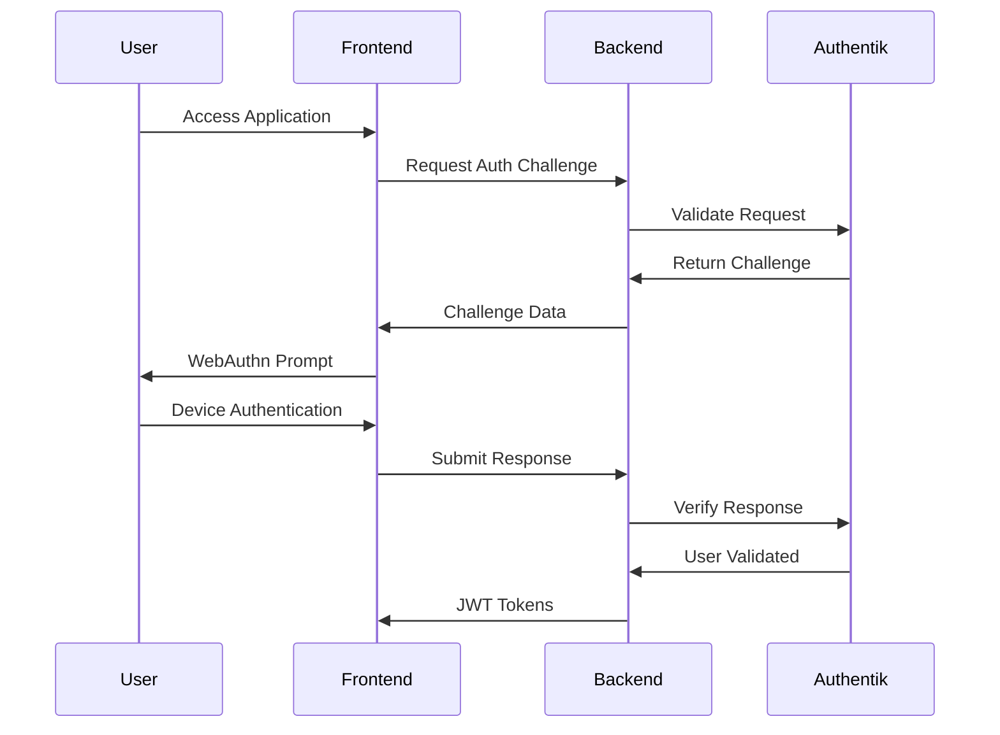

# Authentication Feature Documentation

## Overview

This directory contains comprehensive documentation for the nAI Platform's authentication system, which implements a passwordless, device-based authentication architecture using Authentik as the central authentication provider.

## Quick Links

- [Architecture Overview](./architecture.md)
- [Sprint 100 Implementation](./sprint-100-implementation.md)
- [API Reference](./api-reference.md)
- [Security Guidelines](./security.md)
- [Troubleshooting Guide](./troubleshooting.md)

## Core Principles

1. **No Passwords** - The system explicitly forbids password-based authentication
2. **Device-Based Auth** - WebAuthn/Passkeys are the primary authentication method
3. **Multi-Tenant** - Full tenant isolation at all levels
4. **Authentik Integration** - Centralized authentication provider
5. **GDPR Compliant** - Built-in audit logging and data protection

## Authentication Flow



## Implementation Sprints

The authentication system is implemented across 8 sprints:

### Foundation Phase (Weeks 1-3)
- **[Sprint 100](./sprint-100-implementation.md)**: Foundation & Authentik Integration
- **Sprint 110**: Authentication Middleware & Dependencies

### Core Features (Weeks 4-7)
- **Sprint 120**: Device Authentication System
- **Sprint 130**: Permission & Authorization System
- **Sprint 140**: User & Tenant Management

### Advanced Features (Weeks 8-10)
- **Sprint 150**: WebSocket Authentication
- **Sprint 160**: Testing & Security Hardening
- **Sprint 170**: Integration & Performance

## Key Components

### 1. Authentik Client
- Manages communication with Authentik API
- Handles token validation
- Implements retry logic and error handling

### 2. JWT Validator
- Validates tokens issued by Authentik
- Caches JWKS for performance
- Handles token expiration and refresh

### 3. Token Exchange Service
- Converts Authentik tokens to internal JWTs
- Creates/updates user records
- Manages session lifecycle

### 4. Security Validator
- Enforces no-password policy
- Validates configuration at startup
- Prevents insecure deployments

## Configuration

### Required Environment Variables

```env
# Authentik Configuration
AUTHENTIK_URL=http://127.0.0.1:9000
AUTHENTIK_TOKEN=<admin-token>
AUTHENTIK_PUBLIC_KEY_URL=/application/o/nai-platform/jwks/

# JWT Configuration
JWT_ALGORITHM=RS256
JWT_ISSUER=http://127.0.0.1:9000/application/o/nai-platform/
JWT_AUDIENCE=nai-platform

# Security (DO NOT CHANGE)
DEVICE_AUTH_REQUIRED=true
PASSWORD_AUTH_ENABLED=false
WEBAUTHN_USER_VERIFICATION=required
```

### Important Notes

- Always use `127.0.0.1` instead of `localhost` for Authentik URL
- Authentik blueprints are stored in `Infra/authentik/blueprints/`
- All secrets should be in `.env` file

## Security Requirements

### Mandatory Checks
1. No password fields in database
2. Device authentication required
3. WebAuthn user verification required
4. Authentik properly configured

### Forbidden Patterns
- Password endpoints (`/login`, `/register`)
- Password fields in models
- Password validation logic
- SMS/Email OTP as primary auth

## API Endpoints

### Public Endpoints
- `POST /api/v1/auth/device/register/options`
- `POST /api/v1/auth/device/login`
- `POST /api/v1/auth/token/exchange`

### Protected Endpoints
- `GET /api/v1/users/me`
- `POST /api/v1/auth/token/refresh`
- `DELETE /api/v1/auth/device/{device_id}`

## Testing

### Unit Tests
```bash
pytest tests/unit/auth/ -v
```

### Integration Tests
```bash
pytest tests/integration/auth/ -v
```

### Security Tests
```bash
pytest tests/security/ -v
```

## Monitoring

### Key Metrics
- Authentication success/failure rate
- Token validation latency
- JWKS cache hit rate
- Failed security checks

### Audit Events
- Token exchanges
- User creation
- Security violations
- Permission changes

## Troubleshooting

See the [Troubleshooting Guide](./troubleshooting.md) for common issues and solutions.

## Support

For questions or issues:
1. Check the troubleshooting guide
2. Review security requirements
3. Contact the security team for critical issues

---

**Document Version**: 1.0  
**Last Updated**: 2024-01-20  
**Maintainer**: Development Team