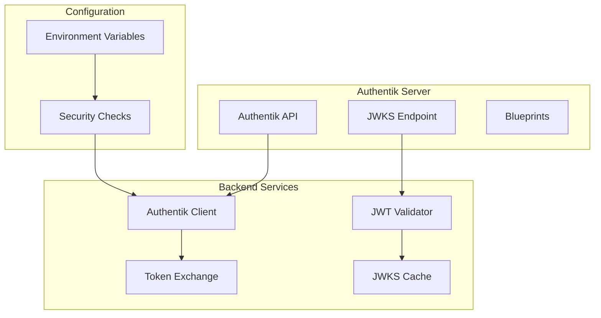

# Sprint 100: Foundation & Authentik Integration - Implementation Guide

## Overview

This document provides the detailed implementation guide for Sprint 100, which establishes the core authentication infrastructure using Authentik as the central authentication provider. This sprint lays the foundation for all subsequent authentication features.

## Architecture Overview



## Task Implementations

### Task 101: Authentik Integration Service and API Client

#### Implementation Details

Create the Authentik client service with proper error handling and retry logic:

```python
# src/infrastructure/auth/authentik_client.py
import httpx
from typing import Optional, Dict, Any
from tenacity import retry, stop_after_attempt, wait_exponential
from src.core.logging import get_logger
from src.core.config import settings

logger = get_logger(__name__)

class AuthentikClient:
    """Client for interacting with Authentik API."""
    
    def __init__(self):
        self.base_url = settings.AUTHENTIK_URL
        self.token = settings.AUTHENTIK_TOKEN
        self.timeout = httpx.Timeout(30.0, connect=5.0)
        self.headers = {
            "Authorization": f"Bearer {self.token}",
            "Content-Type": "application/json"
        }
        
    @retry(
        stop=stop_after_attempt(3),
        wait=wait_exponential(multiplier=1, min=4, max=10)
    )
    async def _request(
        self, 
        method: str, 
        endpoint: str, 
        **kwargs
    ) -> httpx.Response:
        """Make HTTP request to Authentik with retry logic."""
        url = f"{self.base_url}/api/v3/{endpoint}"
        
        async with httpx.AsyncClient(timeout=self.timeout) as client:
            logger.info(
                "authentik_api_request",
                method=method,
                endpoint=endpoint,
                url=url
            )
            
            try:
                response = await client.request(
                    method=method,
                    url=url,
                    headers=self.headers,
                    **kwargs
                )
                response.raise_for_status()
                return response
                
            except httpx.HTTPError as e:
                logger.error(
                    "authentik_api_error",
                    error=str(e),
                    method=method,
                    endpoint=endpoint
                )
                raise AuthentikAPIError(f"API request failed: {e}")
    
    async def get_user(self, user_id: str) -> Dict[str, Any]:
        """Get user details from Authentik."""
        response = await self._request("GET", f"core/users/{user_id}/")
        return response.json()
    
    async def validate_token(self, token: str) -> Dict[str, Any]:
        """Validate token with Authentik."""
        response = await self._request(
            "POST",
            "core/tokens/view_key/",
            json={"key": token}
        )
        return response.json()
```

```python
# src/infrastructure/auth/config.py
from pydantic import BaseSettings, Field, validator
from typing import Optional

class AuthentikConfig(BaseSettings):
    """Authentik configuration with validation."""
    
    AUTHENTIK_URL: str = Field(..., env="AUTHENTIK_URL")
    AUTHENTIK_TOKEN: str = Field(..., env="AUTHENTIK_TOKEN")
    AUTHENTIK_PUBLIC_KEY_URL: str = Field(
        default="/application/o/nai-platform/jwks/",
        env="AUTHENTIK_PUBLIC_KEY_URL"
    )
    
    @validator("AUTHENTIK_URL")
    def validate_url(cls, v):
        if not v.startswith("http"):
            raise ValueError("AUTHENTIK_URL must start with http(s)://")
        # Important: Use 127.0.0.1 not localhost
        if "localhost" in v:
            raise ValueError("Use 127.0.0.1 instead of localhost for Authentik URL")
        return v.rstrip("/")
    
    class Config:
        env_file = ".env"
        extra = "ignore"  # Ignore extra environment variables
```

```python
# src/infrastructure/auth/exceptions.py
class AuthentikError(Exception):
    """Base exception for Authentik-related errors."""
    pass

class AuthentikAPIError(AuthentikError):
    """Error communicating with Authentik API."""
    pass

class AuthentikConfigError(AuthentikError):
    """Configuration error for Authentik."""
    pass
```

### Task 102: JWT Token Validation and JWKS Caching

#### Implementation Details

Implement JWT validation with JWKS caching for performance:

```python
# src/infrastructure/auth/token_validator.py
import json
from typing import Dict, Any, Optional
from datetime import datetime, timedelta
from jose import jwt, jwk, JWTError
from jose.constants import ALGORITHMS
from src.core.logging import get_logger
from src.infrastructure.auth.jwks_cache import JWKSCache
from src.infrastructure.auth.exceptions import InvalidTokenError, TokenExpiredError

logger = get_logger(__name__)

class JWTValidator:
    """Validates JWT tokens issued by Authentik."""
    
    def __init__(self, authentik_client: AuthentikClient):
        self.authentik_client = authentik_client
        self.jwks_cache = JWKSCache(authentik_client)
        self.algorithm = settings.JWT_ALGORITHM
        self.issuer = settings.JWT_ISSUER
        self.audience = settings.JWT_AUDIENCE
        
    async def decode_token(self, token: str) -> Dict[str, Any]:
        """Decode and validate JWT token."""
        try:
            # Get JWKS from cache
            jwks = await self.jwks_cache.get_keys()
            
            # Get unverified header to find key ID
            unverified_header = jwt.get_unverified_header(token)
            kid = unverified_header.get("kid")
            
            # Find the correct key
            key = self._find_key(jwks, kid)
            if not key:
                raise InvalidTokenError("No matching key found in JWKS")
            
            # Decode and validate token
            payload = jwt.decode(
                token,
                key,
                algorithms=[self.algorithm],
                issuer=self.issuer,
                audience=self.audience,
                options={
                    "verify_signature": True,
                    "verify_aud": True,
                    "verify_iss": True,
                    "verify_exp": True,
                    "require_exp": True,
                    "require_iat": True,
                }
            )
            
            # Validate required claims
            self._validate_claims(payload)
            
            logger.info(
                "jwt_validated",
                user_id=payload.get("sub"),
                tenant_id=payload.get("tenant_id")
            )
            
            return payload
            
        except jwt.ExpiredSignatureError:
            logger.warning("jwt_expired", token_preview=token[:20])
            raise TokenExpiredError("Token has expired")
            
        except JWTError as e:
            logger.error("jwt_validation_error", error=str(e))
            raise InvalidTokenError(f"Token validation failed: {e}")
    
    def _find_key(self, jwks: Dict[str, Any], kid: Optional[str]) -> Optional[str]:
        """Find the correct key from JWKS."""
        for key_data in jwks.get("keys", []):
            if kid and key_data.get("kid") != kid:
                continue
            
            try:
                return jwk.construct(key_data)
            except Exception as e:
                logger.error("jwk_construction_error", error=str(e))
                continue
                
        return None
    
    def _validate_claims(self, payload: Dict[str, Any]):
        """Validate required claims are present."""
        required_claims = ["sub", "tenant_id", "exp", "iat"]
        missing_claims = [c for c in required_claims if c not in payload]
        
        if missing_claims:
            raise InvalidTokenError(
                f"Missing required claims: {', '.join(missing_claims)}"
            )
```

```python
# src/infrastructure/auth/jwks_cache.py
import json
from datetime import datetime, timedelta
from typing import Dict, Any, Optional
from cachetools import TTLCache
from src.core.logging import get_logger

logger = get_logger(__name__)

class JWKSCache:
    """Cache for JSON Web Key Set from Authentik."""
    
    def __init__(self, authentik_client: AuthentikClient):
        self.authentik_client = authentik_client
        self.cache = TTLCache(maxsize=10, ttl=3600)  # 1 hour TTL
        self.cache_key = "jwks"
        
    async def get_keys(self) -> Dict[str, Any]:
        """Get JWKS from cache or fetch if expired."""
        # Check cache first
        cached = self.cache.get(self.cache_key)
        if cached:
            logger.debug("jwks_cache_hit")
            return cached
            
        # Fetch new keys
        logger.info("jwks_cache_miss", reason="fetching new keys")
        jwks = await self._fetch_jwks()
        
        # Cache the result
        self.cache[self.cache_key] = jwks
        
        return jwks
    
    async def _fetch_jwks(self) -> Dict[str, Any]:
        """Fetch JWKS from Authentik."""
        try:
            jwks_url = f"{self.authentik_client.base_url}{settings.AUTHENTIK_PUBLIC_KEY_URL}"
            
            async with httpx.AsyncClient() as client:
                response = await client.get(jwks_url)
                response.raise_for_status()
                
            jwks = response.json()
            logger.info("jwks_fetched", key_count=len(jwks.get("keys", [])))
            
            return jwks
            
        except Exception as e:
            logger.error("jwks_fetch_error", error=str(e))
            raise AuthentikAPIError(f"Failed to fetch JWKS: {e}")
    
    async def refresh(self):
        """Force refresh of JWKS cache."""
        logger.info("jwks_cache_refresh", reason="manual refresh")
        self.cache.pop(self.cache_key, None)
        return await self.get_keys()
```

### Task 103: Token Exchange Service

#### Implementation Details

Create the token exchange service to convert Authentik tokens to internal JWTs:

```python
# src/infrastructure/auth/token_exchange.py
from datetime import datetime, timedelta
from typing import Optional, Dict, Any
from uuid import UUID, uuid4
from src.core.auth.jwt_manager import JWTManager
from src.core.logging import get_logger
from src.infrastructure.database.repositories.user import UserRepository
from src.infrastructure.auth.models import TokenResponse, TokenExchangeRequest

logger = get_logger(__name__)

class TokenExchangeService:
    """Exchanges Authentik tokens for internal API tokens."""
    
    def __init__(
        self,
        authentik_client: AuthentikClient,
        jwt_manager: JWTManager,
        user_repository: UserRepository
    ):
        self.authentik_client = authentik_client
        self.jwt_manager = jwt_manager
        self.user_repository = user_repository
        
    async def exchange_token(
        self,
        request: TokenExchangeRequest
    ) -> TokenResponse:
        """Exchange Authentik token for internal tokens."""
        try:
            # Validate Authentik token
            auth_data = await self.authentik_client.validate_token(
                request.authentik_token
            )
            
            if not auth_data.get("is_valid"):
                raise InvalidTokenError("Authentik token is invalid")
            
            # Extract user information
            user_info = auth_data.get("user", {})
            external_id = user_info.get("pk")
            email = user_info.get("email")
            
            if not external_id:
                raise InvalidTokenError("No user ID in token")
            
            # Get or create internal user
            user = await self._get_or_create_user(
                external_id=external_id,
                email=email,
                tenant_id=request.tenant_id,
                attributes=user_info.get("attributes", {})
            )
            
            # Create session
            session_id = str(uuid4())
            
            # Generate internal tokens
            access_token = self.jwt_manager.create_access_token(
                user_id=str(user.id),
                tenant_id=str(request.tenant_id),
                session_id=session_id,
                email=user.email
            )
            
            refresh_token = self.jwt_manager.create_refresh_token(
                user_id=str(user.id),
                tenant_id=str(request.tenant_id),
                session_id=session_id
            )
            
            logger.info(
                "token_exchanged",
                user_id=str(user.id),
                tenant_id=str(request.tenant_id),
                session_id=session_id
            )
            
            return TokenResponse(
                access_token=access_token,
                refresh_token=refresh_token,
                token_type="Bearer",
                expires_in=settings.JWT_ACCESS_TOKEN_EXPIRE_MINUTES * 60,
                user_info={
                    "id": str(user.id),
                    "email": user.email,
                    "tenant_id": str(request.tenant_id)
                }
            )
            
        except Exception as e:
            logger.error("token_exchange_error", error=str(e))
            raise
    
    async def _get_or_create_user(
        self,
        external_id: str,
        email: str,
        tenant_id: UUID,
        attributes: Dict[str, Any]
    ) -> User:
        """Get existing user or create new one."""
        # Try to find existing user
        user = await self.user_repository.get_by_external_id(external_id)
        
        if user:
            # Update last login
            user.last_login = datetime.utcnow()
            await self.user_repository.update(user)
            return user
            
        # Create new user
        user = User(
            external_id=external_id,
            email=email,
            tenant_id=tenant_id,
            display_name=attributes.get("name", email.split("@")[0]),
            is_active=True,
            created_at=datetime.utcnow()
        )
        
        user = await self.user_repository.create(user)
        
        logger.info(
            "user_created_from_token",
            user_id=str(user.id),
            external_id=external_id,
            tenant_id=str(tenant_id)
        )
        
        return user
```

```python
# src/core/auth/jwt_manager.py
from datetime import datetime, timedelta
from typing import Dict, Any
from jose import jwt
from src.core.config import settings
from src.core.logging import get_logger

logger = get_logger(__name__)

class JWTManager:
    """Manages internal JWT token creation and validation."""
    
    def __init__(self):
        self.secret_key = settings.SECRET_KEY
        self.algorithm = "HS256"  # Internal tokens use symmetric key
        self.access_token_expire = timedelta(
            minutes=settings.JWT_ACCESS_TOKEN_EXPIRE_MINUTES
        )
        self.refresh_token_expire = timedelta(
            days=settings.JWT_REFRESH_TOKEN_EXPIRE_DAYS
        )
        
    def create_access_token(
        self,
        user_id: str,
        tenant_id: str,
        session_id: str,
        **extra_claims
    ) -> str:
        """Create internal access token."""
        now = datetime.utcnow()
        expires = now + self.access_token_expire
        
        payload = {
            "sub": user_id,
            "tenant_id": tenant_id,
            "session_id": session_id,
            "type": "access",
            "iat": now,
            "exp": expires,
            **extra_claims
        }
        
        token = jwt.encode(payload, self.secret_key, algorithm=self.algorithm)
        
        logger.debug(
            "access_token_created",
            user_id=user_id,
            tenant_id=tenant_id,
            expires_in=self.access_token_expire.total_seconds()
        )
        
        return token
    
    def create_refresh_token(
        self,
        user_id: str,
        tenant_id: str,
        session_id: str
    ) -> str:
        """Create refresh token."""
        now = datetime.utcnow()
        expires = now + self.refresh_token_expire
        
        payload = {
            "sub": user_id,
            "tenant_id": tenant_id,
            "session_id": session_id,
            "type": "refresh",
            "iat": now,
            "exp": expires
        }
        
        token = jwt.encode(payload, self.secret_key, algorithm=self.algorithm)
        
        logger.debug(
            "refresh_token_created",
            user_id=user_id,
            tenant_id=tenant_id,
            expires_in=self.refresh_token_expire.total_seconds()
        )
        
        return token
```

### Task 104: Environment Configuration and Security Checks

#### Implementation Details

Set up secure configuration and startup validation:

```python
# src/core/auth/security_checks.py
import os
import sys
from typing import List, Tuple
from sqlalchemy import inspect
from src.core.logging import get_logger
from src.core.config import settings
from src.infrastructure.database.models import User

logger = get_logger(__name__)

class SecurityValidator:
    """Validates security configuration at startup."""
    
    def __init__(self):
        self.checks: List[Tuple[str, bool, str]] = []
        
    async def run_all_checks(self) -> bool:
        """Run all security checks and return overall status."""
        logger.info("security_validation_start")
        
        # Check 1: No password authentication enabled
        self.check_password_auth_disabled()
        
        # Check 2: Device auth is required
        self.check_device_auth_required()
        
        # Check 3: Authentik configuration
        await self.check_authentik_config()
        
        # Check 4: No password fields in database
        self.check_no_password_fields()
        
        # Check 5: WebAuthn verification required
        self.check_webauthn_config()
        
        # Log results
        all_passed = True
        for check_name, passed, message in self.checks:
            if passed:
                logger.info(f"security_check_passed", check=check_name)
            else:
                logger.error(f"security_check_failed", check=check_name, reason=message)
                all_passed = False
                
        if not all_passed:
            logger.critical("security_validation_failed", 
                          failed_checks=[c[0] for c in self.checks if not c[1]])
            
        return all_passed
    
    def check_password_auth_disabled(self):
        """Ensure password authentication is disabled."""
        password_auth = os.getenv("PASSWORD_AUTH_ENABLED", "false").lower()
        passed = password_auth == "false"
        
        self.checks.append((
            "password_auth_disabled",
            passed,
            "PASSWORD_AUTH_ENABLED must be false"
        ))
        
    def check_device_auth_required(self):
        """Ensure device authentication is required."""
        device_auth = os.getenv("DEVICE_AUTH_REQUIRED", "true").lower()
        passed = device_auth == "true"
        
        self.checks.append((
            "device_auth_required",
            passed,
            "DEVICE_AUTH_REQUIRED must be true"
        ))
        
    async def check_authentik_config(self):
        """Verify Authentik is properly configured."""
        try:
            # Check required settings
            required = [
                settings.AUTHENTIK_URL,
                settings.AUTHENTIK_TOKEN,
                settings.JWT_ISSUER
            ]
            
            passed = all(required)
            
            # Test connection if configured
            if passed:
                from src.infrastructure.auth.authentik_client import AuthentikClient
                client = AuthentikClient()
                # Try a simple API call
                await client._request("GET", "admin/version/")
                
            self.checks.append((
                "authentik_configured",
                passed,
                "Authentik configuration is complete and reachable"
            ))
            
        except Exception as e:
            self.checks.append((
                "authentik_configured",
                False,
                f"Authentik connection failed: {e}"
            ))
    
    def check_no_password_fields(self):
        """Ensure no password fields exist in User model."""
        try:
            mapper = inspect(User)
            password_columns = [
                col.name for col in mapper.columns 
                if 'password' in col.name.lower()
            ]
            
            passed = len(password_columns) == 0
            
            self.checks.append((
                "no_password_fields",
                passed,
                f"Found password fields: {password_columns}" if password_columns else ""
            ))
            
        except Exception as e:
            self.checks.append((
                "no_password_fields",
                False,
                f"Could not inspect User model: {e}"
            ))
    
    def check_webauthn_config(self):
        """Ensure WebAuthn is properly configured."""
        verification = os.getenv("WEBAUTHN_USER_VERIFICATION", "").lower()
        passed = verification == "required"
        
        self.checks.append((
            "webauthn_verification_required",
            passed,
            "WEBAUTHN_USER_VERIFICATION must be 'required'"
        ))

async def run_startup_security_checks():
    """Run security checks at application startup."""
    validator = SecurityValidator()
    
    if not await validator.run_all_checks():
        logger.critical("startup_security_check_failed",
                       message="Application startup aborted due to security violations")
        sys.exit(1)
    
    logger.info("startup_security_check_passed",
               message="All security checks passed")
```

### Task 105: Authentication Exceptions and Audit Logging

#### Implementation Details

Define the exception hierarchy and integrate with the logging system:

```python
# src/core/auth/exceptions.py
from typing import Optional, Dict, Any
from src.core.logging import get_logger

logger = get_logger(__name__)

class AuthenticationError(Exception):
    """Base exception for authentication errors."""
    
    def __init__(
        self, 
        message: str, 
        details: Optional[Dict[str, Any]] = None,
        log_level: str = "warning"
    ):
        super().__init__(message)
        self.details = details or {}
        
        # Log the exception
        log_method = getattr(logger, log_level, logger.warning)
        log_method(
            "authentication_error",
            error_type=self.__class__.__name__,
            message=message,
            **self.details
        )

class InvalidTokenError(AuthenticationError):
    """JWT validation failed."""
    pass

class TokenExpiredError(AuthenticationError):
    """Token has expired."""
    
    def __init__(self, message: str = "Token has expired"):
        super().__init__(message, log_level="info")

class InsufficientPermissionsError(AuthenticationError):
    """User lacks required permissions."""
    
    def __init__(
        self, 
        required_permission: str,
        user_id: Optional[str] = None
    ):
        super().__init__(
            f"Permission '{required_permission}' required",
            details={
                "required_permission": required_permission,
                "user_id": user_id
            }
        )

class TenantAccessDeniedError(AuthenticationError):
    """User cannot access this tenant."""
    
    def __init__(
        self,
        user_id: str,
        tenant_id: str,
        requested_tenant: str
    ):
        super().__init__(
            "Tenant access denied",
            details={
                "user_id": user_id,
                "user_tenant": tenant_id,
                "requested_tenant": requested_tenant
            },
            log_level="error"
        )

class DeviceNotTrustedError(AuthenticationError):
    """Device authentication failed."""
    
    def __init__(
        self,
        device_id: Optional[str] = None,
        reason: str = "Device not trusted"
    ):
        super().__init__(
            reason,
            details={"device_id": device_id},
            log_level="error"
        )
```

```python
# src/api/exceptions/auth_handlers.py
from fastapi import Request, status
from fastapi.responses import JSONResponse
from src.core.auth.exceptions import (
    AuthenticationError,
    InvalidTokenError,
    TokenExpiredError,
    InsufficientPermissionsError,
    TenantAccessDeniedError,
    DeviceNotTrustedError
)
from src.core.logging import get_logger

logger = get_logger(__name__)

async def authentication_exception_handler(
    request: Request,
    exc: AuthenticationError
) -> JSONResponse:
    """Handle authentication exceptions."""
    
    # Map exceptions to HTTP status codes
    status_map = {
        InvalidTokenError: status.HTTP_401_UNAUTHORIZED,
        TokenExpiredError: status.HTTP_401_UNAUTHORIZED,
        InsufficientPermissionsError: status.HTTP_403_FORBIDDEN,
        TenantAccessDeniedError: status.HTTP_403_FORBIDDEN,
        DeviceNotTrustedError: status.HTTP_401_UNAUTHORIZED,
    }
    
    status_code = status_map.get(
        type(exc), 
        status.HTTP_401_UNAUTHORIZED
    )
    
    # Create response
    response_content = {
        "error": {
            "type": exc.__class__.__name__,
            "message": str(exc)
        }
    }
    
    # Add details for development environments
    if settings.DEBUG:
        response_content["error"]["details"] = exc.details
    
    return JSONResponse(
        status_code=status_code,
        content=response_content,
        headers={"WWW-Authenticate": "Bearer"} if status_code == 401 else None
    )

def register_auth_exception_handlers(app):
    """Register all authentication exception handlers."""
    app.add_exception_handler(
        AuthenticationError,
        authentication_exception_handler
    )
```

```python
# src/core/auth/audit.py
from enum import Enum
from datetime import datetime
from typing import Optional, Dict, Any
from src.core.logging import get_logger
from src.core.logging.audit import log_audit_event, AuditEventType, AuditSeverity

logger = get_logger(__name__)

class AuthAuditEventType(str, Enum):
    """Authentication-specific audit events."""
    TOKEN_EXCHANGE = "auth.token.exchange"
    TOKEN_VALIDATED = "auth.token.validated"
    TOKEN_REJECTED = "auth.token.rejected"
    USER_CREATED = "auth.user.created"
    SECURITY_CHECK_FAILED = "auth.security.check_failed"
    SECURITY_VIOLATION = "auth.security.violation"

async def log_auth_event(
    event_type: AuthAuditEventType,
    user_id: Optional[str] = None,
    tenant_id: Optional[str] = None,
    severity: AuditSeverity = AuditSeverity.LOW,
    details: Optional[Dict[str, Any]] = None
):
    """Log authentication audit event."""
    await log_audit_event(
        event_type=event_type,
        severity=severity,
        details={
            "user_id": user_id,
            "tenant_id": tenant_id,
            "timestamp": datetime.utcnow().isoformat(),
            **(details or {})
        }
    )
```

## Testing

### Unit Tests

```python
# tests/unit/auth/test_authentik_client.py
import pytest
from unittest.mock import Mock, patch
from src.infrastructure.auth.authentik_client import AuthentikClient

@pytest.mark.asyncio
async def test_authentik_client_connection():
    """Test Authentik client can connect."""
    client = AuthentikClient()
    
    with patch('httpx.AsyncClient.request') as mock_request:
        mock_request.return_value = Mock(
            status_code=200,
            json=lambda: {"version": "2023.10.4"}
        )
        
        result = await client._request("GET", "admin/version/")
        assert result.status_code == 200

@pytest.mark.asyncio
async def test_authentik_client_retry():
    """Test retry logic on failure."""
    client = AuthentikClient()
    
    with patch('httpx.AsyncClient.request') as mock_request:
        # First two calls fail, third succeeds
        mock_request.side_effect = [
            Exception("Connection error"),
            Exception("Timeout"),
            Mock(status_code=200, json=lambda: {})
        ]
        
        result = await client._request("GET", "test/")
        assert mock_request.call_count == 3
```

## Configuration

### Environment Variables

```env
# Authentik Configuration (REQUIRED)
AUTHENTIK_URL=http://127.0.0.1:9000
AUTHENTIK_TOKEN=your-authentik-admin-token
AUTHENTIK_PUBLIC_KEY_URL=/application/o/nai-platform/jwks/

# JWT Configuration
JWT_ALGORITHM=RS256
JWT_ISSUER=http://127.0.0.1:9000/application/o/nai-platform/
JWT_AUDIENCE=nai-platform
JWT_ACCESS_TOKEN_EXPIRE_MINUTES=15
JWT_REFRESH_TOKEN_EXPIRE_DAYS=30

# Security Configuration (DO NOT CHANGE)
DEVICE_AUTH_REQUIRED=true
PASSWORD_AUTH_ENABLED=false
WEBAUTHN_USER_VERIFICATION=required

# Internal JWT Secret
SECRET_KEY=your-secret-key-for-internal-tokens
```

### Authentik Blueprint Configuration

The Authentik blueprints are stored in `Infra/authentik/blueprints/` and should include:

1. **Application Configuration** - OAuth2/OIDC provider setup
2. **Passwordless Flow** - WebAuthn authentication flow
3. **Token Scopes** - Required claims and permissions
4. **Tenant Configuration** - Multi-tenant setup

## Troubleshooting

### Common Issues

1. **Connection to Authentik fails**
   - Verify using `127.0.0.1` instead of `localhost`
   - Check Authentik is running and accessible
   - Verify admin token is valid

2. **JWKS fetch fails**
   - Check the public key URL is correct
   - Ensure the application slug matches in Authentik

3. **Security checks fail on startup**
   - Review environment variables
   - Ensure all required values are set correctly
   - Check database schema for password fields

### Debug Mode

Enable debug logging for authentication:

```python
# In your main.py or config
import logging
logging.getLogger("src.infrastructure.auth").setLevel(logging.DEBUG)
```

## Next Steps

With Sprint 100 complete, the foundation is ready for:
- Sprint 110: Authentication Middleware
- Sprint 120: Device Authentication
- Sprint 130: Permission System

The core infrastructure is now in place to build the complete passwordless authentication system.

---

**Document Version**: 1.0  
**Sprint**: 100  
**Last Updated**: 2024-01-20  
**Status**: Implementation Ready