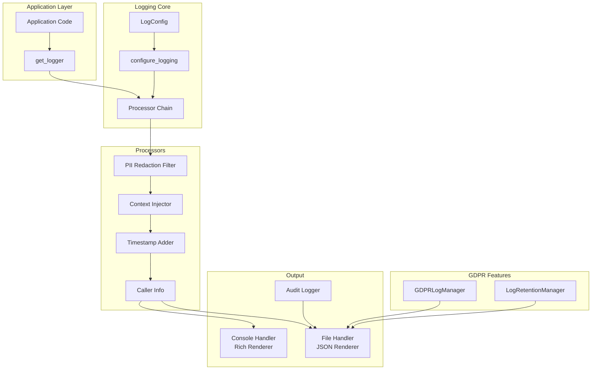

# Logging System Documentation

## Overview

The nAI Backend v5 logging system is a comprehensive, GDPR-compliant logging solution built on structlog. It provides automatic PII redaction, structured logging, audit trails, and log retention management.

## Quick Links

- [GDPR Compliance Guide](./gdpr-compliance.md)
- [Configuration Guide](./configuration.md)
- [Python API Reference](./python-api.md)
- [Troubleshooting](./troubleshooting.md)
- [Migration Guide](./migration.md)

## Features

### 🔒 Privacy & Compliance
- **Automatic PII Redaction**: Email addresses, IPs, phone numbers, SSNs, credit cards
- **GDPR Rights Implementation**: Right to erasure, data portability
- **Audit Logging**: Complete audit trail for compliance
- **Retention Management**: Automatic log cleanup based on retention policies

### 📊 Structured Logging
- **JSON Format**: Machine-readable logs for production
- **Rich Console Output**: Beautiful, readable logs for development
- **Context Injection**: Automatic addition of request_id, tenant_id, user_id
- **Performance Metrics**: Request duration, response size tracking

### 🎨 Developer Experience
- **Dual Output**: Simultaneous console and file logging
- **Log Rotation**: Automatic file rotation with size limits
- **Custom Renderers**: Rich console output with colors and formatting
- **Easy Configuration**: Environment-based configuration

## Architecture



## Quick Start

### Basic Usage

```python
from src.core.logging import get_logger

# Get a logger instance
logger = get_logger(__name__)

# Simple logging
logger.info("Application started")
logger.error("Failed to connect", error="Connection timeout", retry_count=3)

# Structured logging with context
logger.info(
    "User action performed",
    user_id="12345",
    action="login",
    ip_address="192.168.1.1",  # Will be redacted automatically
    email="user@example.com"    # Will be redacted automatically
)
```

### Configuration

```bash
# Environment variables
LOG_LEVEL=INFO                              # DEBUG, INFO, WARNING, ERROR, CRITICAL
LOG_FORMAT=console                          # console or json
LOG_FILE_PATH=/var/log/app/backend.log     # File output path
LOG_RETENTION_DAYS=90                       # GDPR retention period
LOG_ENABLE_PII_FILTERING=true               # Enable PII redaction
LOG_ADD_TIMESTAMP=true                      # Add timestamps
LOG_ADD_CALLER_INFO=true                    # Add file/line info
```

### Audit Logging

```python
from src.core.logging.audit import log_audit_event, AuditEventType, AuditSeverity

# Log security events
log_audit_event(
    event_type=AuditEventType.LOGIN_SUCCESS,
    user_id=user.id,
    ip_address=request.client.host,
    user_agent=request.headers.get("user-agent"),
    severity=AuditSeverity.LOW
)

# Log data access
log_audit_event(
    event_type=AuditEventType.DATA_ACCESS,
    user_id=current_user.id,
    resource=f"document:{document_id}",
    action="read",
    severity=AuditSeverity.MEDIUM
)

# Log GDPR events
log_audit_event(
    event_type=AuditEventType.DATA_ERASURE_REQUEST,
    user_id=admin_user.id,
    target_user_id=user_to_delete.id,
    severity=AuditSeverity.CRITICAL
)
```

## Configuration Examples

### Development Setup

```python
# .env.development
LOG_LEVEL=DEBUG
LOG_FORMAT=console  # Rich console output
LOG_FILE_PATH=./logs/dev.log
LOG_RETENTION_DAYS=7
LOG_ENABLE_PII_FILTERING=true
```

### Production Setup

```python
# .env.production
LOG_LEVEL=INFO
LOG_FORMAT=json  # Structured JSON logs
LOG_FILE_PATH=/var/log/nai/backend.log
LOG_RETENTION_DAYS=90
LOG_ENABLE_PII_FILTERING=true
LOG_ENABLE_TAMPER_PROTECTION=true
```

### Multi-Tenant Setup

```python
# Custom configuration per tenant
from src.core.logging import configure_logging, LogConfig

# Tenant-specific configuration
tenant_config = LogConfig(
    level="DEBUG" if tenant.is_development else "INFO",
    log_file_path=f"/var/log/nai/{tenant.id}/backend.log",
    log_retention_days=tenant.log_retention_days or 90
)

configure_logging(tenant_config)
```

## PII Redaction Examples

### Automatic Redaction

```python
# Input
logger.info("User login", email="john.doe@example.com", ip="192.168.1.100")

# Console Output (Development)
2024-01-20T10:30:45Z | INFO | User login | email=[EMAIL]:a3b4c5d6 | ip=[IPv4]:e7f8a9b0

# File Output (Production)
{
    "timestamp": "2024-01-20T10:30:45Z",
    "level": "info",
    "event": "User login",
    "email": "[EMAIL]:a3b4c5d6",
    "ip_address": "[IPv4]:e7f8a9b0",
    "_pii_redacted": {
        "email": 1,
        "ipv4": 1
    }
}
```

### Custom PII Patterns

```python
from src.core.logging.filters import PIIRedactionFilter, RedactionRule
import re

# Add custom PII pattern
custom_filter = PIIRedactionFilter()
custom_filter.add_rule(
    RedactionRule(
        name="employee_id",
        pattern=re.compile(r"EMP\d{6}"),
        replacement="[EMPLOYEE_ID]",
        hash_value=True,
        description="Employee ID numbers"
    )
)
```

## GDPR Operations

### Data Erasure (Right to be Forgotten)

```python
from src.core.logging.gdpr import GDPRLogManager

manager = GDPRLogManager(log_directory="/var/log/app")

# Erase all logs for a user
await manager.erase_user_data(
    user_id="12345",
    requester_id="admin-001",
    reason="User requested deletion under GDPR Article 17"
)
```

### Data Export (Right to Data Portability)

```python
# Export all user logs
export_path = await manager.export_user_data(
    user_id="12345",
    output_dir="/tmp/gdpr-exports"
)

# Result: JSON file with all user's log entries
{
    "export_metadata": {
        "user_id": "12345",
        "export_date": "2024-01-20T10:30:45Z",
        "gdpr_article": "Article 20 - Right to data portability",
        "total_entries": 1543
    },
    "log_entries": [...]
}
```

## Performance Considerations

### Log Levels Impact

| Level | Console Output | File Output | Performance Impact |
|-------|---------------|-------------|-------------------|
| DEBUG | Full details | Full JSON | High (all logs) |
| INFO | Key events | Structured | Medium |
| WARNING | Warnings only | Warnings+ | Low |
| ERROR | Errors only | Errors+ | Minimal |

### Optimization Tips

1. **Use appropriate log levels**
   ```python
   # Bad - logs on every request
   logger.info(f"Processing request {request_id}")
   
   # Good - only logs errors
   logger.debug(f"Processing request {request_id}")
   ```

2. **Lazy evaluation**
   ```python
   # Bad - always constructs string
   logger.debug(f"Large object: {json.dumps(large_obj)}")
   
   # Good - only constructs if needed
   logger.debug("Large object", data=large_obj)
   ```

3. **Batch operations**
   ```python
   # Use context managers for multiple related logs
   with logger.bind(request_id=request_id):
       logger.info("Request started")
       # ... operations ...
       logger.info("Request completed")
   ```

## Integration Examples

### FastAPI Integration

```python
from fastapi import FastAPI, Request
from src.core.logging import get_logger
from src.core.context import set_request_context
import time

app = FastAPI()
logger = get_logger(__name__)

@app.middleware("http")
async def logging_middleware(request: Request, call_next):
    start_time = time.time()
    request_id = request.headers.get("X-Request-ID", str(uuid.uuid4()))
    
    # Set context for all logs in this request
    set_request_context(
        request_id=request_id,
        tenant_id=request.headers.get("X-Tenant-ID"),
        user_id=getattr(request.state, "user_id", None)
    )
    
    # Log request
    logger.info(
        "Request started",
        method=request.method,
        path=request.url.path,
        query_params=dict(request.query_params)
    )
    
    # Process request
    response = await call_next(request)
    
    # Log response
    duration_ms = (time.time() - start_time) * 1000
    logger.info(
        "Request completed",
        method=request.method,
        path=request.url.path,
        status_code=response.status_code,
        duration_ms=duration_ms
    )
    
    return response
```

### Celery Integration

```python
from celery import Task
from src.core.logging import get_logger

logger = get_logger(__name__)

class LoggingTask(Task):
    """Base task with automatic logging."""
    
    def __call__(self, *args, **kwargs):
        logger.info(
            "Task started",
            task_name=self.name,
            task_id=self.request.id,
            args=args,
            kwargs=kwargs
        )
        
        try:
            result = self.run(*args, **kwargs)
            logger.info(
                "Task completed",
                task_name=self.name,
                task_id=self.request.id,
                result=result
            )
            return result
        except Exception as e:
            logger.error(
                "Task failed",
                task_name=self.name,
                task_id=self.request.id,
                error=str(e),
                exc_info=True
            )
            raise
```

## Monitoring & Alerting

### Log Metrics

```python
# Prometheus metrics from logs
from prometheus_client import Counter

log_events = Counter(
    'log_events_total',
    'Total log events',
    ['level', 'logger']
)

pii_redacted = Counter(
    'pii_redacted_total',
    'Total PII values redacted',
    ['type']
)
```

### Log Aggregation

```json
// Elasticsearch/Logstash configuration
{
    "filter": {
        "json": {
            "source": "message"
        },
        "date": {
            "match": ["timestamp", "ISO8601"]
        },
        "mutate": {
            "add_field": {
                "[@metadata][index_name]": "nai-logs-%{+YYYY.MM.dd}"
            }
        }
    }
}
```

## Common Issues & Solutions

### Issue: Logs not appearing

1. Check log level configuration
2. Verify file permissions
3. Ensure log directory exists

### Issue: PII not being redacted

1. Verify `LOG_ENABLE_PII_FILTERING=true`
2. Check redaction patterns match your data
3. Review custom patterns

### Issue: High memory usage

1. Reduce log retention days
2. Enable log rotation
3. Adjust log level to reduce volume

## See Also

- [GDPR Compliance Guide](./gdpr-compliance.md) - Detailed GDPR features
- [Configuration Reference](./configuration.md) - All configuration options
- [Python API Reference](./python-api.md) - Complete module API documentation
- [Troubleshooting Guide](./troubleshooting.md) - Common issues and solutions
- [Migration Guide](./migration.md) - Upgrading from older versions

---

**Documentation Version**: 1.0  
**Last Updated**: 2024-01-20  
**Component Version**: v5.0.0